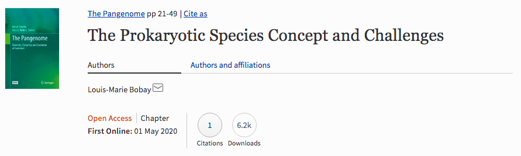

```{r setup, include=FALSE}
knitr::opts_chunk$set(
  echo = FALSE, warning = FALSE, message = FALSE,
  fig.width = 7, fig.height = 2.5, 
  fig.align='center'
)
options(htmltools.dir.version = TRUE)
```

```{r xaringan-tile-view, echo=FALSE}
xaringanExtra::use_tile_view()
```

```{r xaringan-scribble, echo=FALSE}
xaringanExtra::use_scribble()
```

```{r xaringan-panelset, echo=FALSE}
xaringanExtra::use_panelset()
```

## Bactérias e o conceito de espécie

<br />

Bactérias podem ser morfologicamente idênticas, mas fisiologicamente diferentes.

--

Podem adquirir material genético de outras bactérias do mesmo ambiente.

--

.blockquote[
The bacterial species problem can be summarized as follows: bacteria recombine too little, and yet too much.
.right[B. Jesse Shapiro]
]

---

## ANI ("average nucleotide identity")

<br />
Considerada o padrão ouro de classificação de espécies bacterianas.

--

Parte de um conjunto de métricas chamadas "overall genome relatedness indices" (OGRIs).

--

**Base lógica:** bactérias da mesma espécie devem ter um grau mínimo de similaridade genômica.

Possível aplicação na delimitação de gênero. 

---

## A técnica

<br />
Comparações par-a-par entre genomas. Exemplo para bactérias .red[A] e .blue[B]:

1. Dividir o genoma da .red[bactéria A] em fragmentos de 1020 nucleotídeos

--

2. BLAST dos fragmentos da .red[bactéria A (*query*)] contra o genoma da .blue[bactéria B (*reference*)]

--

3. Filtrar todos os *hits* com identidade >30% e cobertura de >70%

--

4. Calcular identidade média de todos os *hits*

--

5. Repetir o processo, mas invertendo os genomas *query* e *reference*

--

6. Calcular média dos dois resultados **(ANI)**

--

- ANI >= 95% &rarr; mesma espécie

- ANI < 95% &rarr; espécies diferentes

---

background-image: url(figs/ani/hemanoel_ani.png)
background-size: 45%
background-position: 50% 70%

## A base teórica por trás do 95%

.footnote[Passarelli-Araujo *et al.,* 2021]

---

## A base teórica por trás do 95%

```{r out.width='75%'}

```

.blockquote[
Because **protein-coding genes are not as selectively constrained as the 16S rRNA subunit**, the ANI threshold used to attain species membership has been empirically defined as **95% based on correlations with 16S sequence threshold** used to define species. (...) Analyses revealed that the **threshold of 70% identity based on DNA–DNA hybridization** assays corresponds approximately to a threshold of **97% identity** when using the 16S rRNA subunit.
]
.blockquote[
ANI thresholds are recognized as much more reliable criteria to define species and 16S rRNA alone is of little taxonomic value when complete genome sequences are available.
]

---

background-image: url(figs/ani/hemanoel_grafo.png)
background-size: 40%
background-position: 50% 70%

## Abordagens baseadas em grafos

.footnote[Passarelli-Araujo *et al.,* 2021]

---

background-image: url(figs/ani/nifH_density.png)
background-size: 75%
background-position: 50% 70%

## ANI para delimitação de gênero

---

background-image: url(figs/ani/combined_nifh.png)
background-size: 75%
background-position: 50% 70%

## ANI para delimitação de gênero

---

## Derivações do ANI

1. **ANIm** (Richter e Rossello-Mora, 2009): substitui o BLAST pelo MUMmer.

2. **OrthoANI** (Lee *et al*., 2016): fragmenta ambos os genomas e
considera apenas os fragmentos que apresentam “best hit recíproco" (RBH) para calcular a identidade média, usando BLAST e USEARCH.

3. **gANI** (Varghese *et al*., 2015): considera apenas regiões codificantes na análise.

<br />
.bold[.brand-charcoal[Nota importante sobre os cortes:]]

- ANIb, ANIm e OrthoANI: 95%

- gANI: 96,5%

---

## Prós e contras

<br />

**Vantagens:**

- Padrão ouro, amplamente utilizado

- Mais preciso que as demais técnicas*


**Desvantagens:**

- Algoritmo $O(n^2)$

- Requer genoma completo (mais caro)

<br />
\*Estudo de caso: *Shigella flexneri* e *Escherichia coli* têm 97.75% de ANI &rarr; espécies diferentes?

---

## Leitura recomendada #1

```{r}

```

<br />
Leitura clássica para consolidar um conhecimento de base. Link [**aqui**](https://doi.org/10.1099/ijs.0.64483-0).

---

## Leitura recomendada #2

```{r}
knitr::include_graphics("figs/ani/paper2.png")
```

Artigo de revisão que descreve o estado-da-arte da taxonomia bacteriana na era dos genomas completos. Link [**aqui**](https://www.nature.com/articles/s41396-021-00941-x).

---

class: sydney-yellow, middle, center

## Contato

`r icons::fontawesome("envelope")`  [fabricio_almeidasilva@hotmail.com](mailto:fabricio_almeidasilva@hotmail.com)

