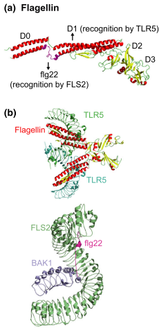
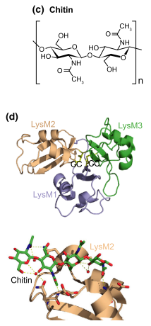
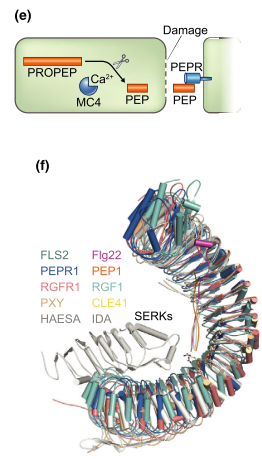
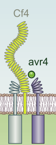
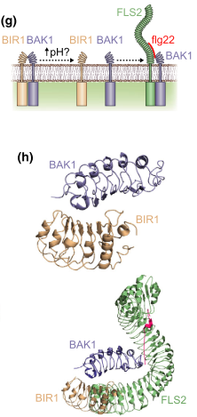
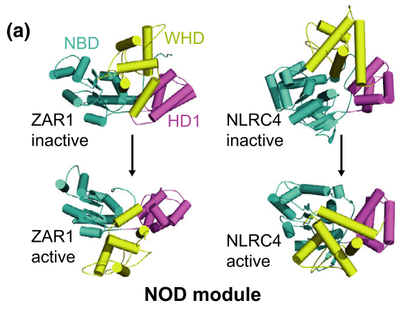
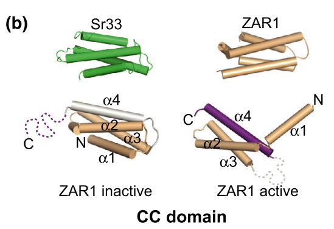
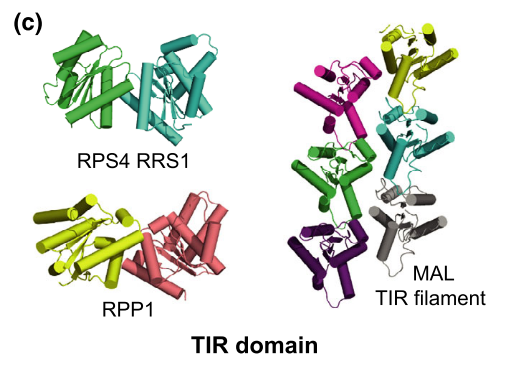

```{r setup, include=FALSE}
knitr::opts_chunk$set(
  echo = FALSE, warning = FALSE, message = FALSE,
  fig.width = 7, fig.height = 2.5, 
  fig.align='center'
)
library(NGLVieweR)
library(shiny)
options(htmltools.dir.version = TRUE)
```

```{r xaringan-tile-view, echo=FALSE}
xaringanExtra::use_tile_view()
```

```{r xaringan-scribble, echo=FALSE}
xaringanExtra::use_scribble()
```

```{r xaringan-panelset, echo=FALSE}
xaringanExtra::use_panelset()
```

background-image: url(figs/ep/pti_eti.png)
background-position: 95% 50%
background-size: 45%

## Defesa de plantas

.pull-left[
Imunidade inata ativa em todas as células.

2 linhas de defesa:

1. PTI (imunidade desencadeada por padrões):
  - PRRs reconhecem PAMPs/DAMPs
2. ETI (imunidade desencadeada por efetores):
  - NLRs reconhecem efetores dos patógenos
]

.footnote[Song *et al.*, 2020]

---

class: center, middle, inverse

# PTI: a linha de frente da defesa de plantas

---

## Receptores de reconhecimento de padrões (PRRs)

<br />
Quinases semelhantes a receptores (RLK) e proteínas semelhantes a receptores (RLPs).

--

Reconhecem padrões moleculares associados a patógenos (PAMPs) e danos (DAMPs).

--

.pull-left[
- RLKs: 

1. Domínio extracelular (reconhecimento)
2. Domínio transmembrana
3. Domínio quinase intracelular (transdução)
]
.pull-right[
- RLPs:

1. Domínio extracelular (reconhecimento)
2. Domínio transmembrana
]

--

RLPs precisam de um correceptor para a transdução de sinal.

---

## Classificação de PRRs

<br />
PRRs podem ser classificados em subfamílias de acordo com o domínio extracelular:

.bold[.font110[.brand-charcoal[Principais subfamílias:]]]
- Repetições ricas em leucina (LRR)
- Motivo lisina (LysM)
- Lectinas
- Quinases associadas a parede (WAK)

--

O reconhecimento de PAMPs/DAMPs induz a dimerização dos PRRs e ativa:
- Produção de ROS
- Influxo de cálcio
- Alcalinização do meio extracelular
- Expressão de genes de defesa

---

## Reconhecimento de PAMPs por PRRs

.panelset.sideways[
.panel[.panel-name[Flagelina]
.pull-left-2[
Componente monomérico do flagelo bacteriano.

Fragmento de 22 resíduos de aminoácidos (flg22) é reconhecido por $FLS2^{LRR}$ em *A. thaliana*.

$FLS2^{LRR}$ reconhece flg22 por ligações de H e interações hidrofóbicas.

A interação $FLS2^{LRR}$-flg22 não induz mudança conformacional, mas cria um sítio de adesão ao correceptor BAK1.

$FLS2^{LRR}$ e BAK1 (**heterodímero**) interagem por interações hidrofóbicas e forças de Van der Waals.

]
.pull-right-1[
```{r out.width='90%'} 

```
.font60[Song *et al.*, 2020]
]
]
.panel[.panel-name[Quitina]
.pull-left-2[
Polímero de *N*-acetilglicosamina (NAG) presente na parede de fungos e exoesqueleto de artrópodes.

*CERK1* e *LYK5* reconhecem oligossacarídeos de quitina em *A. thaliana*.

Domínio extracelular **LysM:** ligação a carboidratos - $\beta$ - $\alpha$ - $\alpha$ - $\beta$

*AtCERK1*: trímero (LysM1, **LysM2** e LysM3) ligado por ligacões dissulfeto.

LysM2 reconhece radical N-acetil e consegue distinguir NAG de glicose.
]
.pull-right-1[
```{r out.width='85%'}

```
.font50[Song *et al.*, 2020]
]
]
.panel[.panel-name[Outros PAMPs]
- **Peptidoglicanos:** 
  - Componentes de paredes bacterianas.
  - Reconhecidos por LYM1 e LYM3

- **EF-Tu:** 
  - Fator de alongamento bacteriano
  - Reconhecido por EFRs
  
- **Lipopolissacarídeos (LPS):**
  - Componentes de paredes de bactérias Gram -
  - Reconhecidos por LOREs
]
]

---

## Reconhecimento de DAMPs por PRRs

.panelset.sideways[
.panel[.panel-name[Definição]
**Padrões do hospedeiro** que atuam como sinais endógenos de ativação da PTI, como:

1. Polipeptídeos precursores que podem sofrer clivagem proteolítica:
  - sisteminas
  - peptídeos eliciadores de plantas (Peps), reconhecidos por PEPRs
  - peptídeos secretados induzidos por PAMPs (PIPs), reconhecidos por RLK7

2. Nucleotídeos e derivados, como ATP (reconhecidos por DORN1).

3. Oligogalacturonídeos, subprodutos da degradação da parede celular (reconhecidos por WAK).
]
.panel[.panel-name[Peps]
.pull-left-2[
Danos induzem a maturação de ProPeps através de processamento por metacaspase dependente de $Ca^{2+}$.

Peps maduros têm 23 resíduos de aminoácidos e são reconhecidos por PEPRs no espaço extracelular.

PEPRs se enovelam em estrutura superhelicoidal como $FLS2^{LRR}$.

C-terminal de Peps altamente conservada: interação com o receptor, mediando interação com o correceptor BAK1.
]
.pull-right-1[
```{r}

```
.footnote[Song *et al.*, 2020]
]
]

]

---

## Ativação de PRRs por correceptores quinases

.footnote[Song *et al.*, 2020]
.pull-left-2[
<br />
Domínio quinase é essencial para a transdução de sinal.

RLPs dependem de dimerização com correceptores quinases.

Interação com o ligante induz a formação de homo/heterodímeros.

PRRs que têm domínio quinase podem ter correceptor quinase: **transfosforilação**.
]
.pull-right-1[
```{r out.width='50%'}

```
]

---

## Regulação negativa de PRRs e homeostase

.footnote[Song *et al.*, 2020]
.pull-left-2[
<br />
Excesso de resposta imune é prejudicial: apoptose.

Receptores BIR como reguladores negativos da morte celular:
  - mutantes BIR- resutam em ativação da apoptose e resposta imune .font70[(Gao *et al.*, 2009)]

BIR forma um heterodímero com BAK1 via interações polares e hidrofóbicas, impedindo sua interação com $FLS2^{LRR}$.

Interação BIR-BAK1 dependente de pH: menor pH favorece.

]
.pull-right-1[
```{r out.width='65%'}

```
]

---

background-image: url(figs/ep/prr.png)
background-size: 95%
background-position: 50% 60%

## PTI: resumo

.footnote[Song *et al.*, 2020]

---

class: center, middle, inverse

# ETI: detecção e defesa de invasores intracelulares

---

## Organização estrutural de domínios de NLRs

Reconhecem ligantes no citplasma.

3 domínios característicos:

1. Repetições ricas em leucinas (LRR, C-terminal)
2. Domínio de oligomerização de ligação a nucleotídeos (NOD)
3. Duas possibilidades no N-terminal:
3.1. Coiled-coil (CC)
3.1. Receptor Toll/interleucina-1 (TIR)

---

## Organização estrutural de domínios de NLRs

.footnote[Song *et al.*, 2020]

.panelset[
.panel[.panel-name[LRR]
Região mais polimórfica das NLRs: especificidade.

Reconhecimento pode ser:
1. Indireto (mais evidências): ligação do LRR a proteínas da planta, formando complexo que reconhece efetores do patógeno.
2. Direto (raras demonstrações bioquímicas): domínio LRR se liga a efetores de forma transiente.
]
.panel[.panel-name[NOD]
.pull-left-2[
Domínio que classifica NLRs como ATPases AAA+.

**Módulo NOD:** Domínio de ligação a nucleotídeo (NBD), domínio helicoidal 1 (HD1), e domínio de hélice alada (WHD)

NOD liga-se a ADP em seu estado inativo, e a ATP em seu estado ativo.

Percepção do ligante induz a troca de ADP por ATP, ativando o módulo.

]
.pull-right-1[
<br />
```{r}


```
]
]
.panel[.panel-name[CC]
.pull-left-2[
Após ativação, podem atuar como sinalizadores de apoptose.

Enovelamento em estrutura pentamérica: hélices N-terminais formam poros na membrana.
]
.pull-right-1[
```{r}

```

]

]
.panel[.panel-name[TIR]
.pull-left-2[
Atividade NADase: morte celular e resposta imune.

Também podem atuar no reconhecimento do patógeno.
]
.pull-right-1[
```{r}

```
]
]
]

---

background-image: url(figs/ep/cc_poros.png)
background-size: 90%

## Reconhecimento indireto e formação de resistossomo

.footnote[Song *et al.*, 2020]

---

background-image: url(figs/ep/inflamassomo.png)
background-size: 90%

## Oligomerização e formação de inflamassomos

.footnote[Song *et al.*, 2020]

---

background-image: url(figs/ep/zar1_pentamero.png)
background-size: 90%

## Diversidade estrutural de NLRs

.footnote[Song *et al.*, 2020]

---

class: middle, center, inverse

# Indução de genes de defesa: 
### Convergência entre PTI e ETI

---

## Proteínas relacionadas à patogênese (PR proteins)

<br />
Proteínas induzidas por estresses bióticos e abióticos.

17 famílias (números em ordem de descoberta).

```{r out.width='110%'}
knitr::include_graphics("https://www.researchgate.net/profile/Shahbaz-Sahi/publication/315476424/figure/tbl1/AS:613911694942262@1523379362944/Classification-of-PR-proteins.png")
```

.footnote[Moosa *et al.*, 2017]

---

## PR-1

<br />
.pull-left-2[

.bold[.brand-charcoal[Representantes:]] <br />Proteínas antifúngicas e antivirais

.bold[.brand-charcoal[Domínio conservado:]] <br /> CAP (caveolin-binding, antigen 5, pathogenesis-related 1) <br /> **(PF00188)**

.bold[.brand-charcoal[Mecanismo de ação:]] <br /> Sequestro de esteróis da membrana do patógeno
]

.pull-right-1[
```{r pr1}
library(NGLVieweR)
NGLVieweR("6V8S", height = '400px', width='400px') %>%
  addRepresentation("cartoon")
```
.footnote[6V8S: PR-1 de *Arachis hypogaea*]
]

---

## PR-2

<br />
.pull-left-2[

.bold[.brand-charcoal[Representantes:]] <br /> $\beta$-1,3-glucanases

.bold[.brand-charcoal[Domínio conservado:]] <br /> Glicosil-hidrolase 17 <br /> **(PF00332)**

.bold[.brand-charcoal[Mecanismo de ação:]] <br /> Hidrólise da parede de fungos e oomicetos <br /> Liberação de eliciadores (PAMPs)
]

.pull-right-1[
```{r pr2}
NGLVieweR::NGLVieweR("4HPG", height = '300px', width='300px') %>%
  NGLVieweR::addRepresentation("cartoon")
```
.footnote[4HPG: beta-1,3-glucanase de *Hevea brasiliensis*]
]

---

## PR-3, PR-4, PR-8 e PR-11

<br />
.pull-left-2[

.bold[.brand-charcoal[Representantes:]] <br /> Quitinases

.bold[.brand-charcoal[Domínio conservado:]] <br /> Glicosil-hidrolase 18 e glicosil-hidrolase 19 <br /> **(IPR016283, IPR001223, IPR011583)**

.bold[.brand-charcoal[Mecanismo de ação:]] <br /> Hidrólise da parede de fungos <br /> Liberação de eliciadores (PAMPs) <br />
Hidrólise da matriz peritrófica de insetos
]

.pull-right-1[
```{r quitinases}
NGLVieweR("3AQU", height = '400px', width='400px') %>%
  addRepresentation("cartoon")
```
.footnote[3AQU: quitinase de classe V de *A. thaliana*]
]

---

## PR-5

<br />
.pull-left-2[

.bold[.brand-charcoal[Representantes:]] <br /> Proteínas semelhantes à taumatina / Osmotinas

.bold[.brand-charcoal[Domínio conservado:]] <br /> Taumatina <br /> **(IPR017949)**

.bold[.brand-charcoal[Mecanismo de ação:]] <br /> Permeabilização de membranas <br />
Inibição de xilanases <br />
Sinalização (indução de apoptose)
]

.pull-right-1[
```{r pr5}
library(NGLVieweR)
NGLVieweR("1Z3Q", height = '400px', width='400px') %>%
  addRepresentation("cartoon")
```
]
.footnote[1Z3Q: TLP de *Musa acuminata*]

---

## PR-6

<br />
.pull-left-2[

.bold[.brand-charcoal[Representantes:]] <br /> Inibidores de proteases

.bold[.brand-charcoal[Domínio conservado:]] <br /> SSP / Inibidor de protease Kunitz / Serpin <br /> **(IPR016140, IPR002160, IPR023795)**

.bold[.brand-charcoal[Mecanismo de ação:]] <br /> Inibição de proteases de intestino de insetos (e.g. tripsina) <br />
Inibição de proteases secretadas por micro-organismos
]

.pull-right-1[
```{r pr6}
library(NGLVieweR)
NGLVieweR("2R33", height = '400px', width='400px') %>%
  addRepresentation("cartoon")
```
.footnote[2R33: Inibidor Bowman-Birk de *Vigna unguiculata*]
]

---

## PR-7

<br />
.pull-left-2[

.bold[.brand-charcoal[Representantes:]] <br /> Proteases

.bold[.brand-charcoal[Domínio conservado:]] <br /> Peptidase S8 / Subtilisin-like / Serino-proteases / Cisteíno-peptidase / Protease aspártica <br />
**(IPR015500, IPR025661, IPR008138, IPR034197)**

.bold[.brand-charcoal[Mecanismo de ação:]] <br /> Proteólise de proteínas invasoras <br />
Ativação de resposta de hipersensibilidade <br />
Liberação de fitormônios de defesa
]

.pull-right-1[
```{r pr7}
library(NGLVieweR)
NGLVieweR("1PPP", height = '400px', width='400px') %>%
  addRepresentation("cartoon")
```
.footnote[1PPP: Papaína de *Carica papaya*]
]

---

## PR-9

<br />
.pull-left-2[

.bold[.brand-charcoal[Representantes:]] <br /> Peroxidase

.bold[.brand-charcoal[Domínio conservado:]] <br /> Peroxidase secretada / Ascorbato peroxidase / Peroxidase com sítio de ligação a heme <br />
**(IPR033905, IPR002207, IPR019793)**

.bold[.brand-charcoal[Mecanismo de ação:]] <br /> Indução de apoptose <br />
Sinalização de defesa
]

.pull-right-1[
```{r pr9}
library(NGLVieweR)
NGLVieweR("1QGJ", height = '400px', width='400px') %>%
  addRepresentation("cartoon")
```
.footnote[1QGJ: Peroxidase N de *A. thaliana*]
]

---

## PR-10

<br />
.pull-left-2[

.bold[.brand-charcoal[Representantes:]] <br /> Proteínas semelhantes a ribonucleases (RLPs)

.bold[.brand-charcoal[Domínio conservado:]] <br /> Domínio semelhante a ribonuclease <br />
**(HOM04D001465)**

.bold[.brand-charcoal[Mecanismo de ação:]] <br /> Degradação de RNAs virais <br />
Citotoxicidade
Indução de apoptose
]

.pull-right-1[
```{r pr10}
library(NGLVieweR)
# NGLVieweR("1VK0", height = '400px', width='400px') %>%
#   addRepresentation("cartoon")

NGLVieweR(here::here("data", "1vk0.pdb"), height='400px', width='400px') %>%
  stageParameters(backgroundColor = "white", zoomSpeed = 1) %>%
  addRepresentation("cartoon",
    param = list(name = "cartoon", colorScheme = "residueindex")
  ) %>%
  setSpin()
```
.footnote[1VK0: ribonuclease de *A. thaliana*]
]

---

## PR-15 e PR-16

<br />
.pull-left-2[

.bold[.brand-charcoal[Representantes:]] <br /> Oxalato oxidase/-like

.bold[.brand-charcoal[Domínio conservado:]] <br /> Germina <br />
**(IPR001929)**

.bold[.brand-charcoal[Mecanismo de ação:]] <br /> Transdução de sinal
]

.pull-right-1[
```{r oxo}
library(NGLVieweR)
NGLVieweR("1FI2", height = '400px', width='400px') %>%
  addRepresentation("cartoon")
```
.footnote[1F12: Germina de *Hordeum vulgare*]
]

---

## PR-17

<br />

.bold[.brand-charcoal[Representantes:]] <br /> Antivirais e antifúngicas

.bold[.brand-charcoal[Domínio conservado:]] <br /> Proteína secretada básica <br /> **(IPR007541)**

.bold[.brand-charcoal[Mecanismo de ação:]] <br /> Atividade proteolítica ?? (baseado em homologia)

---

class: sydney-yellow, middle, center

## Contato

`r icons::fontawesome("envelope")`  [fabricio_almeidasilva@hotmail.com](mailto:fabricio_almeidasilva@hotmail.com)

