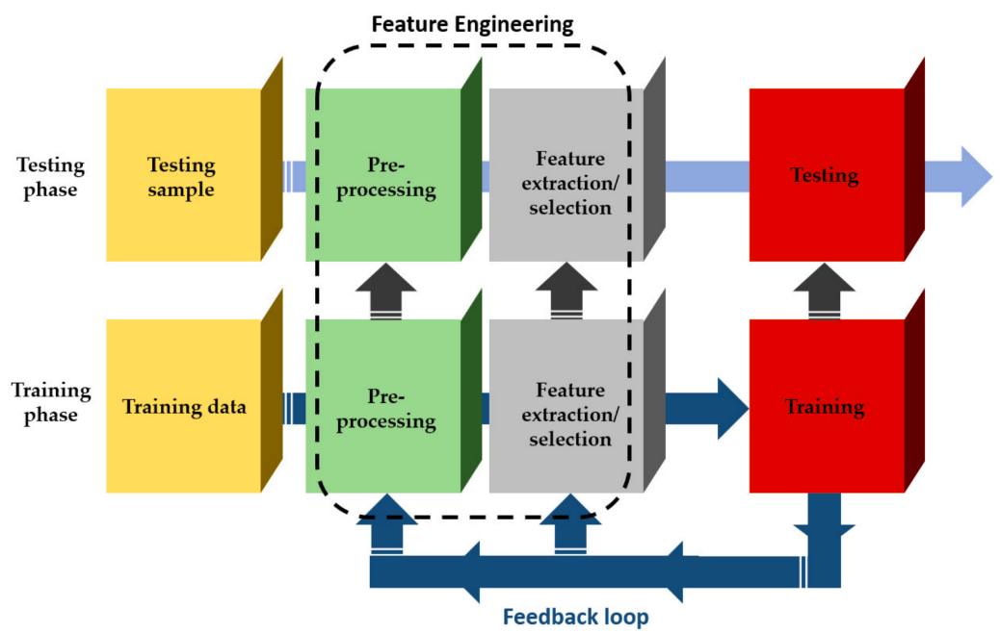

# Distribuições estatísticas

As distribuições estatísticas são funções matemáticas que podem ser usadas para predizer as probabilidades associadas a cada possível destino de uma variável aleatória. As distribuições podem ser **discretas** ou **contínuas**, e conhecê-las é fundamental para entender os modelos estatísticos. Isso porque os modelos estatísticos possuem diversas premissas, dentre elas a distribuição teórica esperada para a variável estudada. Nas seções abaixo, exploraremos brevemente as principais distribuições de probabilidade e exemplos de aplicações nas Ciências da Vida. 

## Distribuição Binomial

A distribuição binomial descreve a probabilidade de observarmos $S = k$ sucessos em N tentativas [@love2016statistical]. Ou seja:

$$
\mbox{Pr}(S=k) = {N \choose k}p^k (1-p)^{N-k}
$$
sendo $p$ a probabilidade de sucesso. Por exemplo, imagine que temos uma população de 1000 ervilhas da geração F2 do experimento de Mendel. O locus V possui dominância completa e determina a cor da ervilha, sendo a cor amarela uma característica dominante. Nesse cenário, ao amostrarmos 10 ervilhas ao acaso, com que frequência poderíamos observar k ervilhas amarelas?

```{r echo=FALSE}
suppressPackageStartupMessages(library(tidyverse))
theme_set(theme_bw())
options(scipen = 99999)
```

```{r}
p <- 0.75
N <- 10
k <- 0:N
tabela_dbinom <- data.frame(
    Numero_amarelas = k,
    Probabilidade = dbinom(k, size = N, prob = p)
)
tabela_dbinom$Porcentagem <- round(tabela_dbinom$Probabilidade * 100, 3)
gt::gt(tabela_dbinom)
```

Visualizando a distribuição binomial para esse exemplo:

```{r out.width='70%', fig.align='center', echo=FALSE}
dist_binom <- rbinom(1000, size = N, prob = p)
data.frame(x = dist_binom) %>%
    ggplot(., aes(x = x, y = ..count.. / sum(..count..) * 100)) +
    geom_histogram(bins=9, fill = "grey40", color = "black") +
    labs(y = "Frequência (%)", x = "Número de ervilhas amarelas") +
    scale_x_continuous(breaks = seq(from = 2, to = 10, by = 1))
```

O histograma acima apresenta com que frequências (em porcentagem) encontraríamos cada número de ervilhas amarelas amostrando 10 ervilhas de uma população de 1000. Note que a probabilidade de obtermos 0 ou apenas 1 ervilha amarela é tão baixa que o número sequer aparece no histograma. 


## Distribuição de Poisson

Quando a probabilidade de sucesso $p$ é muito pequena e o número de tentativas $N$ é muito grande, a distribuição binomial pode ser aproximada pela distribuição de Poisson com taxa $\lambda = np$ [@holmesmodern]. As probabilidades de uma distribuição de Poisson podem ser obtidas com:

$$
\mbox{Pr}(S=k) = \frac{\lambda^k e^{-\lambda}} {k!}
$$

Por exemplo, assuma que mutações no genoma do vírus do mosaico da soja (10 kbp) ocorram aleatoriamente com taxas de $5 \times 10^{-4}$ por nucleotídeo por ciclo de replicação. Isso significa que o número de mutações no genoma do vírus segue uma distribuição de Poisson com taxa 5, ou seja, após um ciclo de replicação, o número de mutações é próximo de 5. Qual é a probabilidade de obtermos de 0 a 12 mutações por ciclo de replicação nesse genoma?

```{r}
lambda <- 5
k <- 0:12
tabela_dpois <- data.frame(
    Numero_amarelas = k,
    Probabilidade = dpois(k, lambda)
)
tabela_dpois$Porcentagem <- round(tabela_dpois$Probabilidade * 100, 3)
gt::gt(tabela_dpois)
```

Visualizando a distribuição de Poisson para esse exemplo:

```{r out.width='70%', fig.align='center', echo=FALSE}
dist_pois <- rpois(10^6, lambda)
data.frame(x = dist_pois[dist_pois %in% 0:12]) %>%
    ggplot(., aes(x = x, y = ..count.. / sum(..count..) * 100)) +
    geom_histogram(bins = 13, fill = "grey40", color = "black") +
    labs(y = "Frequência (%)", x = "Número de mutações") +
    scale_x_continuous(breaks = seq(from = 0, to = 12, by = 1))
```

## Distribuição Normal

A distribuição normal (ou Gaussiana) é uma distribuição tipicamente associada a variáveis contínuas, como altura, peso, etc. Quando a distribuição de uma variável se aproxima de uma distribuição normal, podemos calcular a probabilidade de obtermos um valor dentro de qualquer intervalo com:

$$
\mbox{Pr}(a < x < b) = \int_a^b \frac{1}{\sqrt{2\pi\sigma^2}} \exp{\left( \frac{-(x-\mu)^2}{2 \sigma^2} \right)} \, dx
$$
Por exemplo, vamos observar a distribuição de peso para fêmeas de camundongos. Os dados foram obtidos de @love2016statistical.

```{r echo=FALSE, out.width='70%', fig.align='center'}
female_control <- readr::read_csv("https://raw.githubusercontent.com/genomicsclass/dagdata/master/inst/extdata/mice_pheno.csv", show_col_types = FALSE) %>%
    filter(Sex == "F" & Diet == "chow")

ggplot(female_control, aes(x = Bodyweight)) +
    geom_histogram(aes(y = ..density..), bins = 15,
                   color="black", fill="grey40") +
    geom_density()
```

Calculando média e desvio padrão do peso:

```{r}
media <- mean(female_control$Bodyweight)
media

desvio_padrao <- sd(female_control$Bodyweight)
desvio_padrao
```

Observe que a distribuição se assemelha a uma distribuição normal, com média = 23.9 e desvio padrão = 3.42. Sabendo disso, qual é a probabilidade de, tomando ao acaso, obtermos um camundongo cujo peso é inferior a 16 g? E superior a 30 g? Para isso, basta calcular as probabilidades assumindo uma distribuição normal teórica com esses valores de média e desvio padrão.

```{r}
# P(inferior a 16 g)
pnorm(16, mean = media, sd = desvio_padrao)

# P(superior a 30 g)
1 - pnorm(30, mean = media, sd = desvio_padrao)
```


# Relações entre variáveis: correlação e regressão

Correlação e regressão são duas formas comuns de explorar a relação entre duas variáveis. Embora comumente confundidas, seus objetivos são diferentes.

## Correlação

A correlação é uma medida de associação entre duas variáveis. Usamos testes de correlação para medir a força e direção da asssociação entre duas variáveis, além de atribuir um grau de significância para essa associação (através de um valor de $P$). A força de associação é medida com um **coeficiente de correlação**, que varia de -1 a 1.

```{r echo=FALSE, out.width='80%', fig.align='center', fig.asp=0.4}
set.seed(222)
x <- rnorm(50, 10, 4)
y <- runif(50, min = 0.5, 10) + (1.25*x)
z <- runif(50, min = 0.5, 10) + (-1.25*x)
cor_pos <- data.frame(x, y)
cor_neg <- data.frame(x, y = z)
cor_none <- data.frame(x = x, y = runif(10, min = 0.5, 10))

none <- ggplot(cor_none, aes(x = x, y = y)) +
    geom_point() +
    labs(title = "Nenhuma correlação", subtitle = "(r = 0.01)",
         x = "", y = "")

pos <- ggplot(cor_pos, aes(x = x, y = y)) +
    geom_point() +
    labs(title = "Correlação positiva", subtitle = "(r = 0.88)",
         x = "", y = "")

neg <- ggplot(cor_neg, aes(x = x, y = y)) +
    geom_point() +
    labs(title = "Correlação negativa", subtitle = "(r = -0.85)",
         x = "", y = "")

ggpubr::ggarrange(neg, none, pos, ncol = 3)
```

Por exemplo, vamos calcular a correlação entre a altura de homens e seus filhos. Esses dados foram obtidos por @galton1886regression, e foram estudados à época para estudar a relação existente entre a altura de pais e filhos.

```{r echo=FALSE, out.width='70%', fig.align='center'}
altura <- UsingR::galton
ggplot(altura, aes(x = parent, y = child)) +
    geom_point() +
    geom_jitter(height = 0.6, width = 0.6) +
    labs(title = "Altura dos filhos em função da altura dos pais",
         subtitle = "Dados de Galton (1885)",
         x = "Altura dos pais (in)", y = "Altura dos filhos (in)")
```

```{r}
cor.test(altura$child, altura$parent)
```

As alturas dos pais e de seus filhos apresentam correlação significativa ($P < 0.05$) e moderada (r = 0.46). Nesse exemplo, estamos calculando o **coeficiente de correlação de Pearson**, que assume que as distribuições de ambas as variáveis se aproximam de uma distribuição normal com média $\mu$ e variância $\sigma^2$. Portanto, essa é uma estatística **paramétrica**. Se esse não for o caso dos dados em questão, pode-se calcular o **coeficiente de correlação de Spearman**, que é uma estatística não-paramétrica. 

```{r}
cor.test(altura$child, altura$parent, method = "spearman")
```

Observe que como a distribuição de altura dos pais e dos filhos se aproxima de uma distribuição normal, usar o método de Pearson ou de Spearman leva praticamente ao mesmo coeficiente de correlação.

## Regressão

Enquanto a correlação mede a força e direção da associação entre duas variáveis, a regressão é usada para medir como a mudança em uma variável influencia a mudança em outra. Dessa forma, podemos usar uma variável preditora ($X$, ou variável independente) para predizer a mudança em uma variável de interesse ($Y$, ou variável dependente). Existem diversos modelos de regressão (*e.g.,* linear, quadrática, polinomial, etc.), mas vamos focar nos modelos lineares e suas aplicações.

### Modelos lineares simples

Um modelo de regressão simples pode ser definido matematicamente da seguinte forma:

$$
Y_i = \beta_0 + \beta_1X_i + \epsilon_i
$$
onde $\beta_0$ é o intercepto (ponto da linha que cruza o eixo Y), $\beta_1$ é o coeficiente angular (peso aplicado a $X_i$), $X_i$ é o valor da variável preditora no ponto $i$, $Y_i$ é o valor da variável dependente no ponto $i$, e $\epsilon$ é a variável de erro (resíduo), que segue distribuição normal.

```{r echo=FALSE, fig.align="center", out.width='70%', message=FALSE, warning=FALSE}
set.seed(222)
alpha <- 5.4776
X <- c(1,2,2)
Y <- alpha + (X * 1.2507)
Y[2] <- Y[1]
dt2  <- data.frame(X,Y)
triangle <- data.frame(X = c(1.5,2.13,0),
                       Y = c(6.3, 7.3, 6.2), 
                       label = c("1", "\u03B2_1", "\u03B2_0"))

triangle <- data.frame(X = c(1.5,2.13,0),
                       Y = c(6.3, 7.3, 6.2), 
                       label = c("1", "beta_1", "beta_0"))

x <- rnorm(50, 10, 4)
y <- runif(50, min = 0.5, 10) + (1.25*x)


lm1 <- lm(y ~ x)
p1 <- ggplot(data.frame(x, y), aes(x = x, y = y)) +
    geom_point() +
    geom_smooth(method = "lm", col = "red", 
                linetype = 2, fullrange = TRUE, 
                se = FALSE)

p2 <- p1 + 
  ggforce::geom_mark_circle(aes(y=5.4776 , x=0), 
                            col = "darkgoldenrod2", linetype="dashed",
                            size=1.2) +
  geom_polygon(aes(x = X, y = Y), 
               fill = NA, col = "darkgoldenrod2", 
               linetype = "dashed", size = 1.2 ,data = dt2) +
  geom_label(aes(x = 1.50, y = 6.3, label = 1), parse = TRUE) +
  geom_label(aes(x = 2.13, y = 7.3, label = "beta[1]"), parse = TRUE) +
  geom_label(aes(x = 0.00, y = 6.2, label = "beta[0]"), parse = TRUE) +
  coord_cartesian(xlim = c(0,3),ylim= c(5,10))


p1_fig <- p1 + 
    labs(x = "Variável independente", 
         y = "Variável dependente",
         title = "Regressão linear (Y ~ X)")

p2_fig <- p2 +
    labs(x = "Variável independente", 
         y = "Variável dependente",
         title = "Zoom na observação 1")
ggpubr::ggarrange(p1_fig, p2_fig, ncol = 2)
```

O melhor modelo de regressão linear é aquele que minimiza a **soma dos quadrados dos resíduos**, sendo os resíduos a diferença entre o valor observado e o valor predito no modelo. Vamos usar os dados de @galton1886regression novamente para ajustar um modelo de regressão linear para tentar predizer a altura dos filhos usando a altura dos pais como variável preditora.

```{r message=FALSE, warning=FALSE}
altura <- UsingR::galton
head(altura)

# Ajustando modelo de regressão linear
modelo_lm <- lm(child ~ parent, data = altura)
summary(modelo_lm)
```

Observe que a altura dos pais não é uma boa variável preditora para a altura dos filhos ($R^2 = 0.21$). O coeficiente de determinação $R^2$ representa a proporção da variação em $Y$ explicada por $X$. 

O coeficiente angular $\beta_1$ para o modelo é 0.646. Isso significa que para cada aumento de uma unidade em X (altura dos pais), Y (altura dos filhos) aumenta em 0.64 unidade. Visualizando o modelo:

```{r echo=FALSE, message=FALSE, warning=FALSE, fig.align='center', out.width='70%'}
ggplot(altura, aes(x = parent, y = child)) +
    geom_point() +
    geom_jitter(height = 0.6, width = 0.6) +
    geom_smooth(method = "lm", se = FALSE) +
    labs(title = "Altura dos filhos em função da altura dos pais",
         subtitle = "Dados de Galton (1885)",
         x = "Altura dos pais (in)", y = "Altura dos filhos (in)")
```

A partir do modelo predito, podemos predizer o valor de $Y_i$ para qualquer valor de $X_i$. Por exemplo, qual é a altura predita de uma criança cujo pai tem 65 polegadas de altura? E de uma criança cujo pai tem 67 polegadas?

```{r}
pais <- data.frame(parent = c(65,67))
predict(modelo_lm, newdata = pais)
```

Em certos casos, podemos predizer o valor de uma variável dependente usando 2 ou mais variáveis independentes. Nesse caso, trata-se de uma **regressão linear multivarada ou regressão linear múltipla**, que pode ser expressa da seguinte maneira:

$$
Y_i = \beta_0 + \beta_1 X_{i,1} + \beta_2 X_{i,2} + ... + \beta_p X_{i,p} + \epsilon_i
$$

Ao levar em consideração outras variáveis, podemos aumentar a acurácia do nosso modelo ajustado. Como exemplo, vamos usar uma regressão multivariada para predizer o efeito de diversas variáveis independentes na variável fertilidade. Os dados já vêm disponíveis numa instalação da linguagem R [@R2021], e apresentam a medidade de fertilidade e indicadores socioeconômicos de 47 províncias francófonas da Suiça em 1888.

```{r}
head(swiss)

modelo2 <- lm(Fertility ~ ., data = swiss)
summary(modelo2)
```

É importante ressaltar que a interpretação dos coeficientes para esse tipo de regressão é diferente. Os coeficientes indicam o efeito (em unidades) da variável preditora na variável resposta **mantendo todas as outras variáveis preditoras constantes**. Por exemplo, o modelo acima indica um decréscimo de 0.17 unidade na fertilidade como consequência da agricultura, e um decréscimo de 0.87 unidade como consequência da educação.

### Modelos lineares com interação

Quando duas variáveis independentes têm efeito aditivo na variável dependente, o modelo pode ser ajustado com uma regressão multivariada, como exemplificado acima. Entretanto, se as duas variáveis têm efeito sinérgico na variável dependente, diz-se que as variáveis interagem. Nesse caso, deve-se adicionar um termo de interação no modelo, que passa a ser representado da seguinte forma:

$$
Y_i = \beta_0 + \beta_1 X_{i,1} + \beta_2 X_{i,2} + \beta_3 X_{i, 1}X_{i,2} +  \epsilon_i
$$

### Modelos lineares de efeitos mistos

Um modelo linear simples tem algumas premissas. Uma delas é que as observações são independentes entre si. No entanto, dados biológicos são frequentemente obtidos com fatores de agrupamento, como local de coleta, população, blocos (em agronomia), etc. Como a dependência entre algumas observações viola uma premissa do modelo linear simples, usamos modelos lineares de efeitos mistos, que incluem tanto efeitos fixos (os mesmos do modelo linear simples) quanto efeitos aleatórios (variável que agrupa as observações). Esses modelos podem ser definidos como:

$$
Y_i = \underbrace{\beta X_i}_\text{Efeito fixo} + \underbrace{Z\gamma + e_i}_\text{Efeito aleatório}
$$

Para exemplificar, vamos usar dados obtidos de um experimento que buscava avaliar o efeito da aplicação de diferentes fertilizantes na concentração de nitrogênio em trigo. 

```{r echo=FALSE, fig.align='center', out.width='70%'}
suppressPackageStartupMessages(library(lme4))
concentracao <- c(40.89,37.99,37.18,34.98,34.89,42.07,41.22,49.42,45.85,50.15,
41.99,46.69,44.57,52.68,37.61,36.94,46.65,40.23,41.90,39.20,43.29,
40.45,42.91,39.97)
bloco <- as.factor(sort(rep(1:4,6)))
fertilizante <- as.factor(c(2,5,4,1,6,3,1,3,4,6,5,2,6,3,5,1,2,4,2,4,6,5,3,1))

trigo <- data.frame(concentracao, bloco, fertilizante)
head(trigo)

ggplot(trigo, aes(x = fertilizante, y = concentracao)) +
  geom_boxplot(aes(fill = fertilizante), show.legend = FALSE) +
  ggsci::scale_fill_npg() +
  labs(title = "Efeito de diferentes fertilizantes na concentração de N em trigo",
       x = "Fertilizante", y = "Concentração de N")
```

Esse experimento foi realizado num delineamento em blocos. As plantas dentro do mesmo bloco não são independentes, violando a premissa de independência das observações de um modelo linear simples. Portanto, vamos ajustar um modelo misto usando a variável bloco como efeito aleatório.

```{r}
modelo_misto <- lmer(concentracao ~ fertilizante + (1|bloco), data = trigo)
emmeans::emmeans(modelo_misto, 
                 pairwise ~ fertilizante, 
                 adjust = "Tukey")
```

Os modelos lineares de efeitos mistos são muito populares nos estudos de associação genômica ampla (GWAS), pois permitem levar em consideração o parentesco entre os genomas estudados [@yu2006unified]. Se desconsiderado, o parentesco pode ser um fator de confusão e levar a associações espúrias entre polimorfismos de nucleotídeo único (SNPs) e fenótipos de interesse. Os modelos mistos em GWAS se configuram da seguinte forma:

```{r echo=FALSE, out.width='50%', fig.align='center'}
knitr::include_graphics("gwas_lmm.png")
```

### Modelos lineares generalizados (GLMs)

Como o nome indica, os modelos lineares generalizados (GLMs, do inglês *Generalized Linear Models*) são extensões de modelos lineares. Isso significa que eles são muito similares a modelos lineares simples, mas são mais permissivos em relação a algumas premissas.


**Modelo linear simples:**

1. Observações ($Y_i$) independentes
2. Resíduos seguem distribuição normal com média $\mu$ e variância $\sigma^2$
3. $\mu_i = X_i^T \beta$

**Modelo linear generalizado:**

1. Observações ($Y_i$) independentes
2. Resíduos seguem qualquer distribuição da família exponencial
3. $g(\mu_i) = X_i^T \beta$, onde g é a função de link


Como apontado na comparação acima, a principal diferença entre GLMs e modelos lineares simples é que os resíduos de um GLM podem seguir qualquer distribuição da família exponencial, não apenas uma distribuição normal. Além disso, para ajustar um GLM, é preciso usar uma função de link que conecta $\mu_i$ aos preditores. Abaixo estão as distribuições da família exponencial e suas respectivas funções de link por padrão em linguagem R.


```{r echo=FALSE}
tabela_glm <- data.frame(
  Família = c("Binomial", "Gaussiana", "Gama", 
              "Gaussiana inversa", "Poisson", 
              "Quasi-binomial", "Quasi-Poisson"),
  `Função de link` = c("logit", "identidade", "inversa",
                     "1/mu^2", "log", "logit", "log")
)
gt::gt(tabela_glm)
```

Para exemplificar a aplicação de um GLM, vamos ajustar uma **regressão logística** em um conjunto de dados onde a variável dependente é binária, não contínua. Os dados apresentam os níveis de glicose no sangue de indivíduos e o diagnóstico de diabetes (variável binária, sim ou não). O objetivo é predizer se o indivíduo tem diabetes

```{r echo=FALSE}
set.seed(222)
data("PimaIndiansDiabetes2", package = "mlbench")
diabetes <- PimaIndiansDiabetes2
idx <- sample(1:768, 750)
diabetes_dados <- diabetes[idx, ]
diabetes_pred <- diabetes[-idx, ]
head(diabetes_dados)
```

```{r}
modelo <- glm(diabetes ~ glucose, data = diabetes_dados, family = binomial)
summary(modelo)
```

Com o modelo ajustado, podemos predizer se uma pessoa tem ou não diabetes do tipo 2 usando os níveis de glicose como variável preditora. A predição do modelo nos fornece probabilidades. Aqui, vamos considerar um limiar de 50% para definir se o indivíduo tem diabetes, isto é, indivíduos com mais de 50% de probabilidade de serem diabéticos serão considerados diabéticos.

```{r}
newdata <- data.frame(glucose = c(20,  180))
prob <- modelo %>% 
  predict(newdata, type = "response")
predicao <- ifelse(prob > 0.5, "pos", "neg")
predicao
```

```{r echo=FALSE, out.width='70%', fig.align='center', message=FALSE, warning=FALSE}
diabetes_dados %>%
  mutate(prob = ifelse(diabetes == "pos", 1, 0)) %>%
  ggplot(aes(glucose, prob)) +
  geom_point(alpha = 0.2) +
  geom_smooth(method = "glm", method.args = list(family = "binomial")) +
  labs(
    title = "Modelo de regressão logística", 
    x = "Concentração de glicose",
    y = "Probabilidade de ser diabético"
    )
```

# *Big data* na agricultura: aprendizagem de máquina e integração de dados

Nas últimas décadas, dados fisiológicos e moleculares de plantas acumularam em bancos de dados públicos. Esse fenômeno abriu caminhos para algoritmos destinados à integração de dados com o objetivo de extrair informações relevantes e fazer predições [@benos2021machine], em especial ao campo da aprendizagem de máquina (ML, do inglês *machine learning*). Esses algoritmos usam informações de centenas de observações para diversas variáveis para identificar padrões [@benos2021machine] que podem ser usados para predição em novos dados.

```{r fig.align='center', out.width='70%', fig.cap="Figure extraída de Benos et al., 2021", echo=FALSE}

```

A principal vantagem desses algoritmos em relação aos modelos tradicionais é a sua maior precisão, pois os modelos de classificação são complexos, envolvendo muitas variáveis preditoras. Ainda, alguns algoritmos de ML são capazes de decompor as variáveis preditoras em camadas (*deep learning*), aumentando ainda mais a precisão da predição.

# Referências {.unnumbered}


