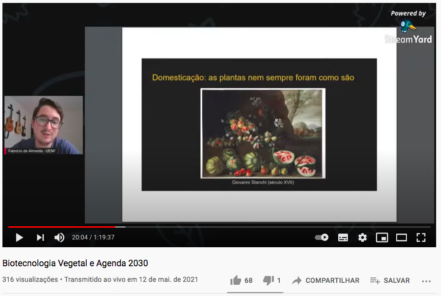

```{r setup, include=FALSE}
knitr::opts_chunk$set(
  echo = FALSE, warning = FALSE, message = FALSE,
  fig.width = 7, fig.height = 2.5, 
  fig.align='center'
)
options(htmltools.dir.version = TRUE)
```

```{r xaringan-tile-view, echo=FALSE}
xaringanExtra::use_tile_view()
```

```{r xaringan-scribble, echo=FALSE}
xaringanExtra::use_scribble()
```

```{r xaringan-panelset, echo=FALSE}
xaringanExtra::use_panelset()
```

## Atividade

<br />

```{r}

```

.center[
[Palestra](https://www.youtube.com/watch?v=FmgR_bU7dJo) no canal do **Ciência Pra Gente** com o tema: **Biotecnologia Vegetal e Agenda 2030**.
]

---

## Motivação

```{r out.width="70%"}

```

"Biotec" e "agro" são palavras frequentemente associadas a desmatamento, poluição e exploração.

**Proposta:** demonstrar *com exemplos* como a biotecnologia vegetal pode contribuir para um mundo mais sustentável e menos desigual.

---

## A palestra

```{r out.width='75%'}

```

---

## Autoavaliação

<br />

`r emo::ji("eye")` &nbsp; Muita gente presente.

--

`r emo::ji("thumbs_up")` &nbsp; Muitas avaliações positivas da audiência.

--

`r emo::ji("speech_balloon")` &nbsp; Participação surpreendentemente alta - piadas, perguntas, exclamações, etc.

--

`r emo::ji("check")` &nbsp; Mensagem absorvida - comentários e relatos dos alunos. 
--


**Avaliação:** excelente.

---

class: sydney-yellow, middle, center

## Contato

`r icons::fontawesome("envelope")`  [fabricio_almeidasilva@hotmail.com](mailto:fabricio_almeidasilva@hotmail.com)

