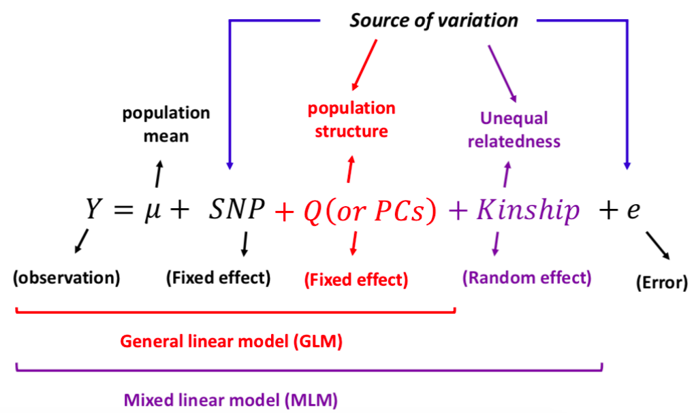
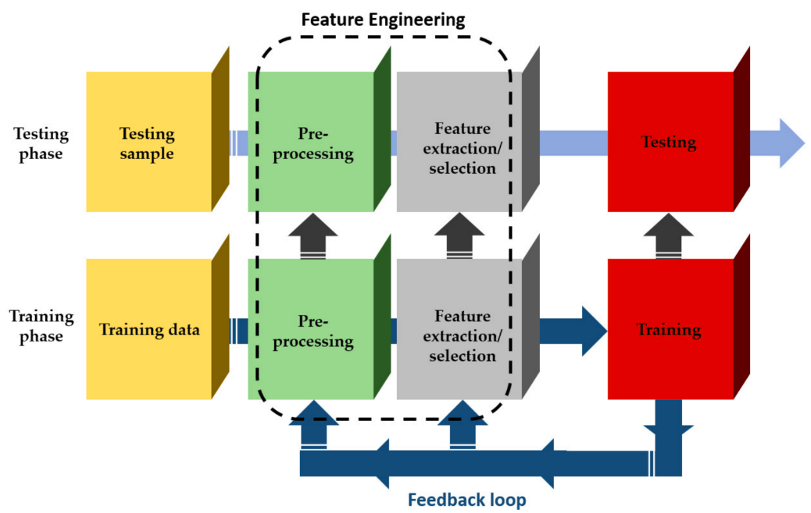

```{r setup, include=FALSE}
knitr::opts_chunk$set(
  echo = FALSE, warning = FALSE, message = FALSE,
  fig.width = 7, fig.height = 2.5, 
  fig.align='center'
)
hook_source <- knitr::knit_hooks$get('source')
knitr::knit_hooks$set(source = function(x, options) {
  x <- stringr::str_replace(x, "^[[:blank:]]?([^*].+?)[[:blank:]]*#<<[[:blank:]]*$", "*\\1")
  hook_source(x, options)
})
options(htmltools.dir.version = TRUE)
```

```{r xaringan-tile-view, echo=FALSE}
xaringanExtra::use_tile_view()
```

```{r xaringan-scribble, echo=FALSE}
xaringanExtra::use_scribble()
```

```{r xaringan-panelset, echo=FALSE}
xaringanExtra::use_panelset()
```

class: inverse, center, middle

# Distribuições estatísticas

---

## Distribuições estatísticas

<br />
Funções matemáticas que podem ser usadas para predizer as probabilidades associadas a cada possível destino de uma variável aleatória. 

Podem ser: 
- discretas
- contínuas

Cada modelo estatístico assume uma distribuição teórica para a variável em questão.

---

## Distribuição Binomial

.panelset.sideways[
.panel[.panel-name[Definição]
Descreve a probabilidade de observarmos $S = k$ sucessos em N tentativas. Ou seja:

$$
\mbox{Pr}(S=k) = {N \choose k}p^k (1-p)^{N-k}
$$
sendo $p$ a probabilidade de sucesso.

]
.panel[.panel-name[Exemplo]
1000 ervilhas da geração F2 do experimento de Mendel. Amostrando 10 ervilhas ao acaso, com que frequência poderíamos observar k ervilhas amarelas (V_)?

```{r echo=FALSE}
suppressPackageStartupMessages(library(tidyverse))
theme_set(theme_bw())
options(scipen = 99999)
```

.pull-left-2[
```{r dbinom, echo=TRUE, eval=FALSE}
p <- 0.75
N <- 10
k <- 0:N
tabela_dbinom <- data.frame(
    N_amarelas = k,
    Probabilidade = dbinom(k, size = N, #<<
                           prob = p) #<<
)
tabela_dbinom$Porcentagem <- round(tabela_dbinom$Probabilidade * 100, 3)
gt::gt(tabela_dbinom)
```
]
.pull-right-1[
```{r ref.label="dbinom"}
```
]

]
.panel[.panel-name[Visualização]
```{r fig.width=10, fig.height=6, fig.align='center', echo=FALSE, dpi=200}
dist_binom <- rbinom(1000, size = N, prob = p)
data.frame(x = dist_binom) %>%
  ggplot(., aes(x = x, y = ..count.. / sum(..count..) * 100)) +
  geom_histogram(bins=9, fill = "grey40", color = "black") +
  labs(y = "Frequência (%)", x = "Número de ervilhas amarelas") +
  scale_x_continuous(breaks = seq(from = 2, to = 10, by = 1)) +
  labs(title = "Frequência esperada (em %) de cada número de ervilhas amarelas")
```

]
]

---

## Distribuição de Poisson

.panelset.sideways[
.panel[.panel-name[Definição]

Quando a probabilidade de sucesso $p$ é muito pequena e o número de tentativas $N$ é muito grande, a distribuição binomial pode ser aproximada pela distribuição de Poisson com taxa $\lambda = np$. As probabilidades de uma distribuição de Poisson podem ser obtidas com:

$$
\mbox{Pr}(S=k) = \frac{\lambda^k e^{-\lambda}} {k!}
$$

]

.panel[.panel-name[Exemplo]
Mutações no genoma do vírus do mosaico da soja (10 kbp) ocorrem aleatoriamente com taxas de $5 \times 10^{-4}$ /nucleotídeo/ciclo de replicação. 

.pull-left[

**Qual é a probabilidade de obtermos de 0 a 12 mutações por ciclo de replicação nesse genoma?**

```{r dpois, echo=TRUE, eval=FALSE}
lambda <- 5
k <- 0:12
tabela_dpois <- data.frame(
    Mutacoes = k,
    Probabilidade = dpois(k, lambda) #<<
)
tabela_dpois$Porcentagem <- round(tabela_dpois$Probabilidade * 100, 3)
gt::gt(tabela_dpois)
```
]
.pull-right[
```{r ref.label="dpois"}
```
]
]

.panel[.panel-name[Visualização]
```{r fig.width=10, fig.height=6, fig.align='center', echo=FALSE, dpi=200}
dist_pois <- rpois(10^6, lambda)
data.frame(x = dist_pois[dist_pois %in% 0:12]) %>%
  ggplot(., aes(x = x, y = ..count.. / sum(..count..) * 100)) +
  geom_histogram(bins = 13, fill = "grey40", color = "black") +
  labs(y = "Frequência (%)", x = "Número de mutações") +
  scale_x_continuous(breaks = seq(from = 0, to = 12, by = 1)) +
  labs(title = "Frequência esperada (em %) de cada número de mutações")
```
]

]

---

## Distribuição Normal

.panelset.sideways[
.panel[.panel-name[Definição]
Distribuição tipicamente associada a variáveis contínuas, como altura, peso, etc. Quando a distribuição de uma variável se aproxima de uma distribuição normal, podemos calcular a probabilidade de obtermos um valor dentro de qualquer intervalo com:

$$
\mbox{Pr}(a < x < b) = \int_a^b \frac{1}{\sqrt{2\pi\sigma^2}} \exp{\left( \frac{-(x-\mu)^2}{2 \sigma^2} \right)} \, dx
$$

]

.panel[.panel-name[Ex. (1)]
```{r echo=FALSE, fig.width=11, fig.height=5, fig.align='center'}
female_control <- readr::read_csv("https://raw.githubusercontent.com/genomicsclass/dagdata/master/inst/extdata/mice_pheno.csv", show_col_types = FALSE) %>%
    filter(Sex == "F" & Diet == "chow")

ggplot(female_control, aes(x = Bodyweight)) +
    geom_histogram(aes(y = ..density..), bins = 15,
                   color="black", fill="grey40") +
    geom_density() + 
  labs(title = "Peso de camundongos fêmeas (Love et al., 2016)",
       y = "Densidade", x = "Peso")
```

.pull-left[
```{r echo=TRUE}
mean(female_control$Bodyweight)
```
]

.pull-right[
```{r echo=TRUE}
sd(female_control$Bodyweight)
```
]

]

.panel[.panel-name[Ex. (2)]
Tomando ao acaso, qual a probabilidade de obtermos um camundongo cujo peso é inferior a 16 g? E superior a 30 g?

```{r echo=TRUE}
# P(inferior a 16 g)
pnorm(16, mean = 23.893, sd = 3.424)

# P(superior a 30 g)
1 - pnorm(30, mean = 23.893, sd = 3.424)
```
]

]

---

class: inverse, center, middle

# Relações entre variáveis

---

## Correlação

.panelset.sideways[
.panel[.panel-name[Definição]
Medida de força e direção da associação entre duas variáveis, medida com um **coeficiente de correlação** que varia de -1 a 1.

```{r echo=FALSE, fig.width=11, fig.height=8, fig.align='center', fig.asp=0.4}
set.seed(222)
x <- rnorm(50, 10, 4)
y <- runif(50, min = 0.5, 10) + (1.25*x)
z <- runif(50, min = 0.5, 10) + (-1.25*x)
cor_pos <- data.frame(x, y)
cor_neg <- data.frame(x, y = z)
cor_none <- data.frame(x = x, y = runif(10, min = 0.5, 10))

none <- ggplot(cor_none, aes(x = x, y = y)) +
    geom_point() +
    labs(title = "Nenhuma correlação", subtitle = "(r = 0.01)",
         x = "", y = "")

pos <- ggplot(cor_pos, aes(x = x, y = y)) +
    geom_point() +
    labs(title = "Correlação positiva", subtitle = "(r = 0.88)",
         x = "", y = "")

neg <- ggplot(cor_neg, aes(x = x, y = y)) +
    geom_point() +
    labs(title = "Correlação negativa", subtitle = "(r = -0.85)",
         x = "", y = "")

ggpubr::ggarrange(neg, none, pos, ncol = 3)
```
]

.panel[.panel-name[Exemplo (1)]

```{r echo=FALSE, fig.width=11, fig.height = 6, fig.align='center'}
altura <- UsingR::galton
ggplot(altura, aes(x = parent, y = child)) +
    geom_point() +
    geom_jitter(height = 0.6, width = 0.6) +
    labs(title = "Altura dos filhos em função da altura dos pais",
         subtitle = "Dados de Galton (1885)",
         x = "Altura dos pais (in)", y = "Altura dos filhos (in)")
```
]

.panel[.panel-name[Exemplo (2)]

- **Coeficiente de correlação de Pearson** - $r$

Método paramétrico - assume que ambas as variáveis seguem distribuição normal com média $\mu$ e variância $\sigma^2$.

```{r echo=TRUE}
cor.test(altura$child, altura$parent)
```
]

.panel[.panel-name[Exemplo (3)]
- **Coeficiente de correlação de Spearman** - $\rho$

Método não-paramétrico, baseado em *ranks*.

```{r echo=TRUE}
cor.test(altura$child, altura$parent, method = "spearman")
```

]
]

---

## Regressão

<br />
Usada para medir como a mudança em uma variável influencia a mudança em outra. 

- $X_i$ - variável preditora ou variável independente
- $Y_i$ - variável resposta ou variável dependente. 

Existem diversos modelos de regressão (*e.g.,* **linear**, quadrática, polinomial, etc.).

---

## Modelos lineares simples

<br />
Definido matematicamente da seguinte forma:

$$
Y_i = \beta_0 + \beta_1X_i + \epsilon_i
$$

```{r echo=FALSE, fig.width=11, fig.height=5, fig.align="center", message=FALSE, warning=FALSE}
set.seed(222)
alpha <- 5.4776
X <- c(1,2,2)
Y <- alpha + (X * 1.2507)
Y[2] <- Y[1]
dt2  <- data.frame(X,Y)
triangle <- data.frame(X = c(1.5,2.13,0),
                       Y = c(6.3, 7.3, 6.2), 
                       label = c("1", "\u03B2_1", "\u03B2_0"))

triangle <- data.frame(X = c(1.5,2.13,0),
                       Y = c(6.3, 7.3, 6.2), 
                       label = c("1", "beta_1", "beta_0"))

x <- rnorm(50, 10, 4)
y <- runif(50, min = 0.5, 10) + (1.25*x)


lm1 <- lm(y ~ x)
p1 <- ggplot(data.frame(x, y), aes(x = x, y = y)) +
    geom_point() +
    geom_smooth(method = "lm", col = "red", 
                linetype = 2, fullrange = TRUE, 
                se = FALSE)

p2 <- p1 + 
  ggforce::geom_mark_circle(aes(y=5.4776 , x=0), 
                            col = "darkgoldenrod2", linetype="dashed",
                            size=1.2) +
  geom_polygon(aes(x = X, y = Y), 
               fill = NA, col = "darkgoldenrod2", 
               linetype = "dashed", size = 1.2 ,data = dt2) +
  geom_label(aes(x = 1.50, y = 6.3, label = 1), parse = TRUE) +
  geom_label(aes(x = 2.13, y = 7.3, label = "beta[1]"), parse = TRUE) +
  geom_label(aes(x = 0.00, y = 6.2, label = "beta[0]"), parse = TRUE) +
  coord_cartesian(xlim = c(0,3),ylim= c(5,10))


p1_fig <- p1 + 
    labs(x = "Variável independente", 
         y = "Variável dependente",
         title = "Regressão linear (Y ~ X)")

p2_fig <- p2 +
    labs(x = "Variável independente", 
         y = "Variável dependente",
         title = "Zoom na observação 1")
ggpubr::ggarrange(p1_fig, p2_fig, ncol = 2)
```

---

## Modelos lineares simples

<br />
O melhor modelo de regressão linear é aquele que minimiza a **soma dos quadrados dos resíduos**, sendo os resíduos a diferença entre o valor observado e o valor predito no modelo.

```{r lm2, fig.align="center", fig.width=11, fig.height=6, message=FALSE, warning=FALSE}
set.seed(222)
x <- rnorm(50, 10, 4)
y <- runif(50, min = 0.5, 10) + (1.25*x)
z <- predict(lm(y~x))
ggplot(data.frame(x,y,z), aes(x=x,y=y)) +
  geom_point(col="dodgerblue2", alpha=0.65) +
  geom_smooth(method="lm", col="red", linetype=2,fullrange=TRUE, se=FALSE) +
  geom_segment(aes(xend=c(x), yend=c(z)), size=0.4,
               arrow=arrow(length=unit(0.15,"cm")))
```

---

## Exemplo: predição de altura dos filhos

```{r message=FALSE, warning=FALSE}
altura <- UsingR::galton
```

```{r echo=TRUE}
modelo_lm <- lm(child ~ parent, data = altura)
summary(modelo_lm)
```

---

## Exemplo: predição de altura dos filhos

```{r echo=FALSE, message=FALSE, warning=FALSE, fig.align='center', fig.width=11, fig.height=6}
ggplot(altura, aes(x = parent, y = child)) +
    geom_point() +
    geom_jitter(height = 0.6, width = 0.6) +
    geom_smooth(method = "lm", se = FALSE) +
    labs(title = "Altura dos filhos em função da altura dos pais",
         subtitle = "Dados de Galton (1885)",
         x = "Altura dos pais (in)", y = "Altura dos filhos (in)")
```


$$A_{filho} = 23.94 + 0.65 A_{pai}$$

---

## Exemplo: predição de altura dos filhos

<br />
Qual é a altura predita de uma criança cujo pai tem 65 polegadas de altura? E de uma criança cujo pai tem 67 polegadas?

```{r echo=TRUE}
pais <- data.frame(parent = c(65, 67))
predict(modelo_lm, newdata = pais)
```

---

## Regressão linear multivariada

<br />
Regressão usando 2 ou mais variáveis independentes. Pode ser expressa por:

$$Y_i = \beta_0 + \beta_1 X_{i,1} + \beta_2 X_{i,2} + ... + \beta_p X_{i,p} + \epsilon_i$$

Ao levar em consideração outras variáveis, podemos aumentar a acurácia do nosso modelo ajustado.

---

## Exemplo: regressão linear multivariada

Conjunto de dados **swiss**: medida de fertilidade e indicadores socioeconômicos de 47 províncias francófonas da Suiça em 1888.

```{r}
head(swiss)
```

---

## Exemplo: regressão linear multivariada

```{r echo=TRUE}
summary(lm(Fertility ~ ., data = swiss))
```

---

## Corrigindo para termos de interação

- Variáveis independentes com efeito aditivo:

```{r eval=FALSE, echo=TRUE}
lm(VD ~ VI1 + VI2)
```

- Variáveis independentes com efeito sinérgico (retas se cruzando)

```{r eval=FALSE, echo=TRUE}
lm(VD ~ VI1 * VI2)
```

$$Y_i = \beta_0 + \beta_1 X_{i,1} + \beta_2 X_{i,2} + \beta_3 X_{i, 1}X_{i,2} +  \epsilon_i$$

---

## Modelos lineares de efeitos mistos

<br />
Usado quando as observações não são independentes entre si, pois estão agrupadas de alguma forma (*e.g.,* local de coleta, população, blocos, etc). 

Incluem efeitos fixos (os mesmos do modelo linear simples) e efeitos aleatórios (variável que agrupa as observações). 

Podem ser definidos como:

$$Y_i = \underbrace{\beta X_i}_\text{Efeito fixo} + \underbrace{Z\gamma + e_i}_\text{Efeito aleatório}$$

---

## Exemplo: delineamento em blocos

<br />
.pull-left-1[
```{r}
suppressPackageStartupMessages(library(lme4))
concentracao <- c(40.89,37.99,37.18,34.98,34.89,42.07,41.22,49.42,45.85,50.15,
41.99,46.69,44.57,52.68,37.61,36.94,46.65,40.23,41.90,39.20,43.29,
40.45,42.91,39.97)
bloco <- as.factor(sort(rep(1:4,6)))
fertilizante <- as.factor(c(2,5,4,1,6,3,1,3,4,6,5,2,6,3,5,1,2,4,2,4,6,5,3,1))

trigo <- data.frame(concentracao, bloco, fertilizante)
head(trigo)
```
]

.pull-right-2[
```{r echo=FALSE, fig.align='center', fig.width=11, fig.height=6}
suppressPackageStartupMessages(library(lme4))
concentracao <- c(40.89,37.99,37.18,34.98,34.89,42.07,41.22,49.42,45.85,50.15,
41.99,46.69,44.57,52.68,37.61,36.94,46.65,40.23,41.90,39.20,43.29,
40.45,42.91,39.97)
bloco <- as.factor(sort(rep(1:4,6)))
fertilizante <- as.factor(c(2,5,4,1,6,3,1,3,4,6,5,2,6,3,5,1,2,4,2,4,6,5,3,1))

trigo <- data.frame(concentracao, bloco, fertilizante)

ggplot(trigo, aes(x = fertilizante, y = concentracao)) +
  geom_boxplot(aes(fill = fertilizante), show.legend = FALSE) +
  ggsci::scale_fill_npg() +
  labs(title = "Efeito de diferentes fertilizantes na concentração de N em trigo",
       x = "Fertilizante", y = "Concentração de N")
```
]

---

## Exemplo: delineamento em blocos

.pull-left[
```{r echo=TRUE}
modelo_misto <- lmer(concentracao ~ fertilizante + (1|bloco), data = trigo)
emmeans::emmeans(modelo_misto, 
                 pairwise ~ fertilizante, 
                 adjust = "Tukey")$emmeans
```
]

.pull-right[
```{r echo=TRUE}
emmeans::emmeans(modelo_misto, pairwise ~ fertilizante, 
                 adjust = "Tukey")$contrasts
```
]

---

## Modelos mistos em GWAS

<br />
Os GWAS buscam identificar variantes (SNPs) associados a fenótipos de interesse, mas o parentesco entre os indivíduos é um fator de confusão.

```{r echo=FALSE, out.width='60%', fig.align='center'}

```

---

## Modelos lineares generalizados (GLMs)

<br />
Extensões de modelos lineares, pois são mais permissivos em relação a algumas premissas.

.pull-left[
**Modelo linear simples:**

1. Observações ($Y_i$) independentes
2. Resíduos seguem distribuição normal com média $\mu$ e variância $\sigma^2$
3. $\mu_i = X_i^T \beta$
]

.pull-right[
**Modelo linear generalizado:**

1. Observações ($Y_i$) independentes
2. Resíduos seguem qualquer distribuição da família exponencial
3. $g(\mu_i) = X_i^T \beta$, onde g é a função de link
]

---

## Modelos lineares generalizados

<br />
Distribuições da família exponencial e suas funções de link.

```{r echo=FALSE, out.width='80%'}
tabela_glm <- data.frame(
  Família = c("Binomial", "Gaussiana", "Gama", 
              "Gaussiana inversa", "Poisson", 
              "Quasi-binomial", "Quasi-Poisson"),
  `Função de link` = c("logit", "identidade", "inversa",
                     "1/mu^2", "log", "logit", "log")
)
gt::gt(tabela_glm)
```

---

## Exemplo: regressão logística

<br />
Objetivo: predizer se o indivíduo tem diabetes do tipo 2 usando a concentração de glicose no sangue.

```{r echo=FALSE}
set.seed(222)
data("PimaIndiansDiabetes2", package = "mlbench")
diabetes <- PimaIndiansDiabetes2
idx <- sample(1:768, 750)
diabetes_dados <- diabetes[idx, ]
diabetes_pred <- diabetes[-idx, ]
head(diabetes_dados)
```

---

## Exemplo: regressão logística

```{r echo=TRUE}
modelo <- glm(diabetes ~ glucose, data = diabetes_dados, family = binomial)
summary(modelo)
```

---

## Exemplo: regressão logística

```{r echo=TRUE}
newdata <- data.frame(glucose = c(20,  180))
prob <- predict(modelo, newdata, type = "response")
prob

ifelse(prob > 0.5, "pos", "neg")
```

---

## Exemplo: regressão logística

<br />
```{r echo=FALSE, fig.width=11, fig.height=6, fig.align='center', message=FALSE, warning=FALSE}
diabetes_dados %>%
  mutate(prob = ifelse(diabetes == "pos", 1, 0)) %>%
  ggplot(aes(glucose, prob)) +
  geom_point(alpha = 0.2) +
  geom_smooth(method = "glm", method.args = list(family = "binomial")) +
  labs(
    title = "Modelo de regressão logística", 
    x = "Concentração de glicose",
    y = "Probabilidade de ser diabético"
    )
```

---

## *Big data* na agricultura

```{r fig.align='center', out.width='70%', fig.cap="Figure extraída de Benos et al., 2021", echo=FALSE}

```

---

class: sydney-yellow, middle, center

## Contato

`r icons::fontawesome("envelope")`  [fabricio_almeidasilva@hotmail.com](mailto:fabricio_almeidasilva@hotmail.com)

