```{r setup, include=FALSE}
knitr::opts_chunk$set(
  echo = FALSE, warning = FALSE, message = FALSE,
  fig.width = 7, fig.height = 2.5, 
  fig.align='center'
)
options(htmltools.dir.version = TRUE)
```

```{r xaringan-tile-view, echo=FALSE}
xaringanExtra::use_tile_view()
```

```{r xaringan-scribble, echo=FALSE}
xaringanExtra::use_scribble()
```

```{r xaringan-panelset, echo=FALSE}
xaringanExtra::use_panelset()
```

background-image: url(https://www.pnas.org/content/pnas/107/18/8063/F1.large.jpg?width=800&height=600&carousel=1)
background-size: 75%
background-position: 50% 60%

## Da embriogênese à germinação

.footnote[Le *et al.*, 2010]

---

## Objetivo

.center[.brand-charcoal[.font120[Identificar padrões espaço-temporais de coexpressão gênica em sementes de soja e identificar genes e vias associadas aos padrões.]]]

--

```{r out.width='80%'}
knitr::include_graphics("figs/redes_example1.png")
```

---

## Objetivo

.center[.brand-charcoal[.font120[Identificar padrões espaço-temporais de coexpressão gênica em sementes de soja e identificar genes e vias associadas aos padrões.]]]

```{r out.width='60%'}
knitr::include_graphics("http://s.glbimg.com/jo/g1/f/original/2013/09/13/odr20130913164.jpg")
```

.footnote[Fonte: G1]

---

class: inverse, center, middle

# Rede #1: Semente

---

## Descrição dos dados

**BioProjects:** 5

.panelset[
.panel[.panel-name[PRJNA184365]
Jones SI et al., "Using RNA-Seq to profile soybean seed development from fertilization to maturity.", PLoS One, 2013;8(3):e59270

**Amostras:**
1. 5 mg
1. 4 DAF
1. 12 DAF
1. 22 DAF
1. Semente seca
]
.panel[.panel-name[PRJNA384236]
Pereira Lima JJ et al., "Molecular characterization of the acquisition of longevity during seed maturation in soybean.", PLoS One, 2017;12(7):e0180282

.pull-left-1[
**Amostras:**
1. Estágio 7.1
1. Estágio 7.2
1. Estágio 7.3
1. Estágio 8.1
1. Estágio 8.2
]
.pull-right-2[
```{r out.width='85%'}
knitr::include_graphics("https://www.ncbi.nlm.nih.gov/pmc/articles/instance/5507495/bin/pone.0180282.g001.jpg")
```
]
]
.panel[.panel-name[PRJNA140081]
Lin JY et al., "Similarity between soybean and Arabidopsis seed methylomes and loss of non-CG methylation does not affect seed development.", Proc Natl Acad Sci U S A, 2017 Nov 7;114(45):E9730-E9739

**Amostras:**

1. Estágio globular
1. Estágio de coração
1. Estágio cotiledonar
1. Início da maturação
1. Meio da maturação
1. Final da maturação
1. Semente seca
]
.panel[.panel-name[PRJNA384236]
Título do projeto: "Germinating soybean seed RNAseq analysis"

**Amostras:**
1. Semente seca
1. Semente embebida
1. Semente germinada
]
.panel[.panel-name[PRJNA539842]
Título do projeto: "Transcriptome of soybean ovules and developing seeds"

**Amostras:**
1. 10 DAF
2. 20 DAF
3. 30 DAF
4. 40 DAF
]
]

---

```{r}
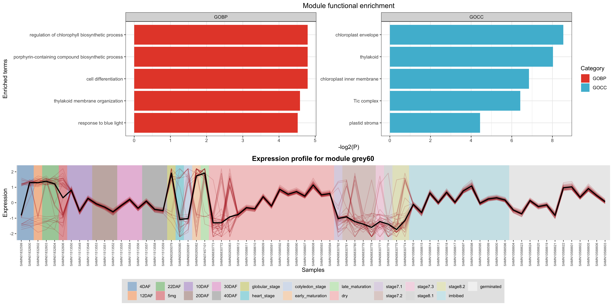
```

.green[=========].red[===============].blue[======================].orange[==========]============================
&emsp;&nbsp;&nbsp;Mat
&emsp;&emsp;&emsp;&emsp;&emsp;Mat
&emsp;&emsp;&emsp;&emsp;&emsp;&emsp;&emsp;Em &rarr; Mat
&emsp;&emsp;&emsp;&emsp;&emsp;Mat
&emsp;&emsp;&emsp;&emsp;&emsp;&emsp;&emsp;&emsp;Germ

---

```{r}
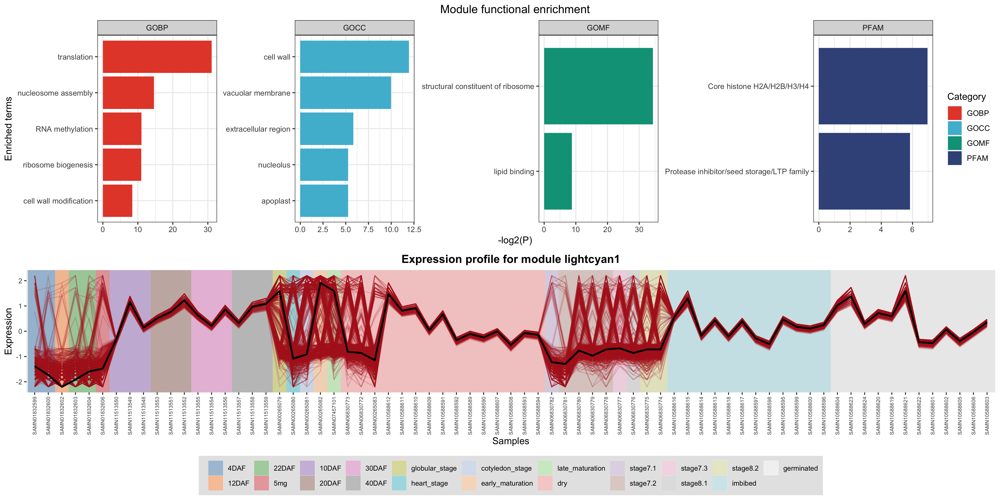
```

.green[=========].red[===============].blue[======================].orange[==========]============================
&emsp;&nbsp;&nbsp;Mat
&emsp;&emsp;&emsp;&emsp;&emsp;Mat
&emsp;&emsp;&emsp;&emsp;&emsp;&emsp;&emsp;Em &rarr; Mat
&emsp;&emsp;&emsp;&emsp;&emsp;Mat
&emsp;&emsp;&emsp;&emsp;&emsp;&emsp;&emsp;&emsp;Germ

---

class: inverse, middle, center

# Rede #2: Tegumento

---

## Descrição dos dados

**BioProjects:** 5

.panelset[
.panel[.panel-name[PRJNA197251]
Danzer J et al., "Down-Regulating the Expression of 53 Soybean Transcription Factor Genes Uncovers a Role for SPEECHLESS in Initiating Stomatal Cell Lineages during Embryo Development.", Plant Physiol, 2015 Jul;168(3):1025-35

**Amostras:**
1. Hilo
1. Osteoesclereídes
1. Células paliçádicas

]
.panel[.panel-name[PRJNA246314]
Título do projeto: "Gene Expression Changes in the Development of the Soybean Seed-Heart Stage"

.pull-left-1[
**Amostras:**
1. Endotélio
1. Epiderme
1. Integumento interno
1. Integumento externo

]
.pull-right-2[
```{r out.width='80%'}
knitr::include_graphics("http://www.seedbiology.de/html2images/mueller-fig1b.jpg")
```
]
]
.panel[.panel-name[PRJNA246315]
Título do projeto: "Gene Expression Changes in the Development of the Soybean Seed-Globular Stage"

.pull-left-1[
**Amostras:**
1. Endotélio
1. Epiderme
1. Integumento interno
1. Integumento externo

]
.pull-right-2[
```{r out.width='80%'}
knitr::include_graphics("http://www.seedbiology.de/html2images/mueller-fig1b.jpg")
```
]
]
.panel[.panel-name[PRJNA246783]
Título do projeto: "Gene Expression Changes in the Development of the Soybean Seed-Cotyledon Stage"

.pull-left-1[
**Amostras:**
1. Endotélio
1. Epiderme
1. Integumento interno
1. Integumento externo

]
.pull-right-2[
```{r out.width='80%'}
knitr::include_graphics("http://www.seedbiology.de/html2images/mueller-fig1b.jpg")
```
]
]
.panel[.panel-name[PRJNA387303]
Título do projeto: "Gene Expression Changes in the Development of the Soybean Seed Mid-Maturation (B1) Stage"

**Amostras:**
1. Meio da maturação
]
]

---

```{r}
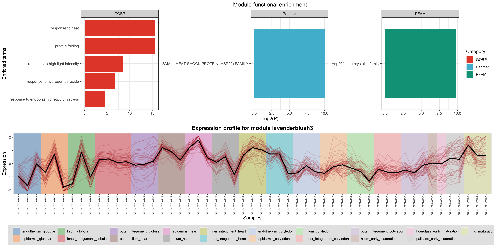
```

.green[============================].red[======================].blue[=======================].orange[============]
&emsp;&emsp;&emsp;&emsp;&emsp;&nbsp;&nbsp;Em-Glob
&emsp;&emsp;&emsp;&emsp;&emsp;&emsp;&emsp;&emsp;&emsp;&emsp;Em-Heart
&emsp;&emsp;&emsp;&emsp;&emsp;&emsp;&emsp;&emsp;&nbsp;Em-Cot
&emsp;&emsp;&emsp;&emsp;&emsp;&emsp;&emsp;Mat

---

```{r}
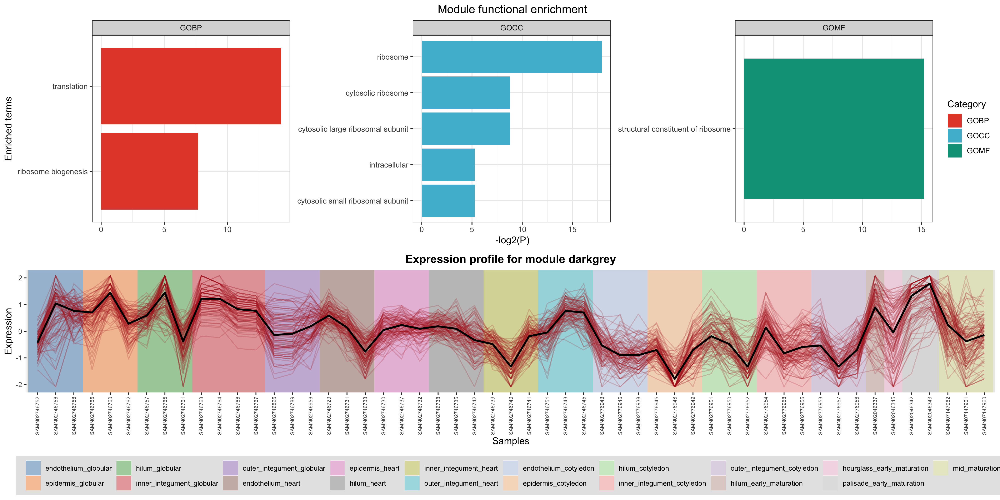
```

.green[============================].red[======================].blue[=======================].orange[============]
&emsp;&emsp;&emsp;&emsp;&emsp;&nbsp;&nbsp;Em-Glob
&emsp;&emsp;&emsp;&emsp;&emsp;&emsp;&emsp;&emsp;&emsp;&emsp;Em-Heart
&emsp;&emsp;&emsp;&emsp;&emsp;&emsp;&emsp;&emsp;&nbsp;Em-Cot
&emsp;&emsp;&emsp;&emsp;&emsp;&emsp;&emsp;Mat

---

```{r}
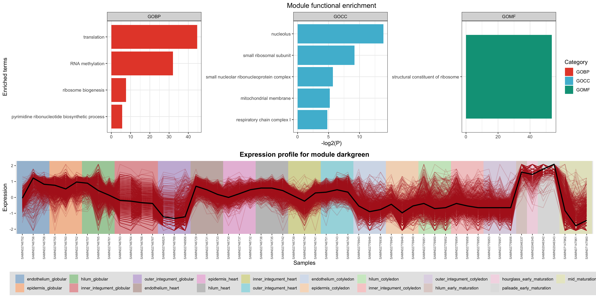
```

.green[============================].red[======================].blue[=======================].orange[============]
&emsp;&emsp;&emsp;&emsp;&emsp;&nbsp;&nbsp;Em-Glob
&emsp;&emsp;&emsp;&emsp;&emsp;&emsp;&emsp;&emsp;&emsp;&emsp;Em-Heart
&emsp;&emsp;&emsp;&emsp;&emsp;&emsp;&emsp;&emsp;&nbsp;Em-Cot
&emsp;&emsp;&emsp;&emsp;&emsp;&emsp;&emsp;Mat

---

class: inverse, middle, center

# Rede #3: Cotilédone

---

## Descrição dos dados

**BioProjects:** 5

.panelset[
.panel[.panel-name[PRJNA182292]
Shamimuzzaman M et al., "Transcription factors and glyoxylate cycle genes prominent in the transition of soybean cotyledons to the first functional leaves of the seedling.", Funct Integr Genomics, 2014 Dec;14(4):683-96

**Amostras:**
- 1-7 dias após a embebição
]

.panel[.panel-name[PRJNA184365]
Jones SI et al., "Using RNA-Seq to profile soybean seed development from fertilization to maturity.", PLoS One, 2013;8(3):e59270

**Amostras:**
1. 5-6 mg 
1. 100-200 mg
1. 400-500 mg
]
.panel[.panel-name[PRJNA246783]
Título do projeto: "Gene Expression Changes in the Development of the Soybean Seed-Cotyledon Stage"

**Amostras:**
1. Estágio cotiledonar
]
.panel[.panel-name[PRJNA262564]
Brown AV et al., "Developmental profiling of gene expression in soybean trifoliate leaves and cotyledons.", BMC Plant Biol, 2015 Jul 3;15:169

**Amostras:**
1. 4 dias após o plantio
1. 15 dias após o plantio
1. 27 dias após o plantio
]
.panel[.panel-name[PRJNA387303]
Título do projeto: "Gene Expression Changes in the Development of the Soybean Seed Mid-Maturation (B1) Stage"

**Amostras:**
1. Metade da maturação
]
]

---

```{r}
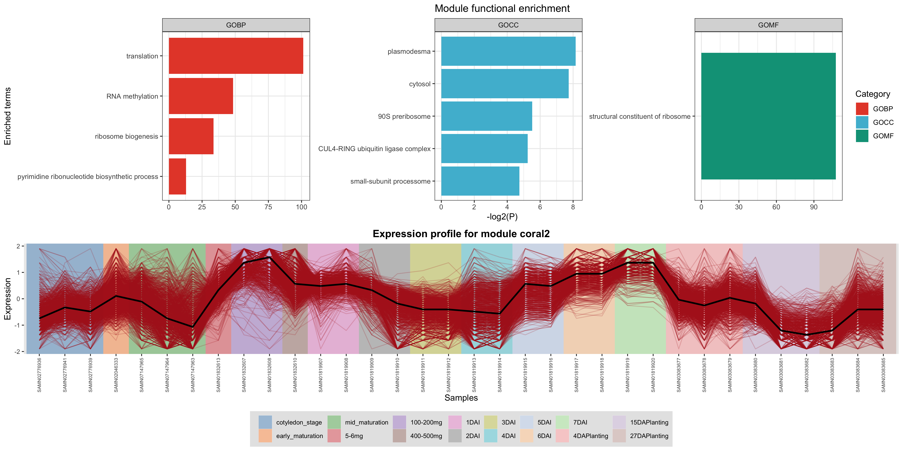
```

.green[====================].red[=========].blue[=================================].orange[======================]
&emsp;&emsp;&emsp;&emsp;&emsp;Mat
&emsp;&emsp;&emsp;&emsp;&emsp;&emsp;Mat
&emsp;&emsp;&emsp;&emsp;&emsp;&emsp;&emsp;&emsp;&nbsp;Germ
&emsp;&emsp;&emsp;&emsp;&emsp;&emsp;&emsp;&emsp;&emsp;&emsp;&emsp;Germ+Pós-Germ

---

```{r}
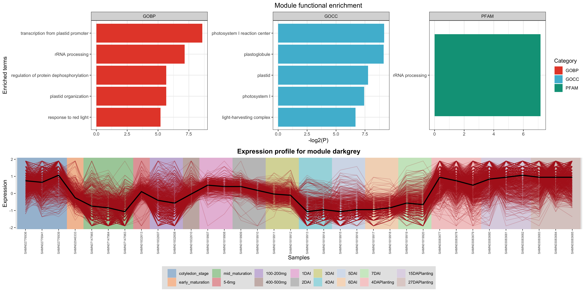
```

.green[====================].red[=========].blue[=================================].orange[======================]
&emsp;&emsp;&emsp;&emsp;&emsp;Mat
&emsp;&emsp;&emsp;&emsp;&emsp;&emsp;Mat
&emsp;&emsp;&emsp;&emsp;&emsp;&emsp;&emsp;&emsp;&nbsp;Germ
&emsp;&emsp;&emsp;&emsp;&emsp;&emsp;&emsp;&emsp;&emsp;&emsp;&emsp;Germ+Pós-Germ

---

```{r}
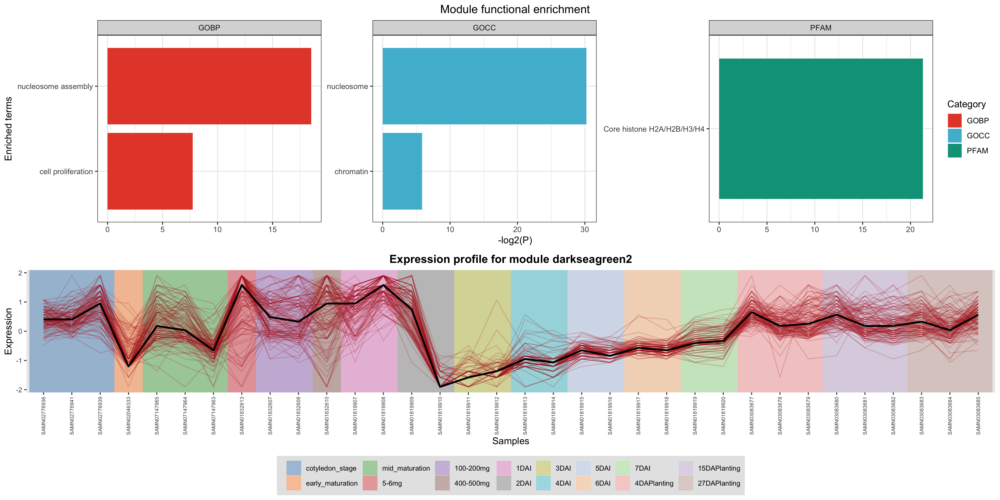
```

.green[====================].red[=========].blue[=================================].orange[======================]
&emsp;&emsp;&emsp;&emsp;&emsp;Mat
&emsp;&emsp;&emsp;&emsp;&emsp;&emsp;Mat
&emsp;&emsp;&emsp;&emsp;&emsp;&emsp;&emsp;&emsp;&nbsp;Germ
&emsp;&emsp;&emsp;&emsp;&emsp;&emsp;&emsp;&emsp;&emsp;&emsp;&emsp;Germ+Pós-Germ

---

```{r}
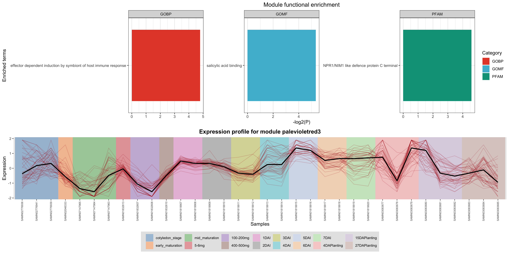
```

.green[====================].red[=========].blue[=================================].orange[======================]
&emsp;&emsp;&emsp;&emsp;&emsp;Mat
&emsp;&emsp;&emsp;&emsp;&emsp;&emsp;Mat
&emsp;&emsp;&emsp;&emsp;&emsp;&emsp;&emsp;&emsp;&nbsp;Germ
&emsp;&emsp;&emsp;&emsp;&emsp;&emsp;&emsp;&emsp;&emsp;&emsp;&emsp;Germ+Pós-Germ

---

class: inverse, middle, center

# Rede #4: Embrião

---

## Descrição dos dados

**BioProjects:** 8

.panelset[
.panel[.panel-name[197251]
Danzer J et al., "Down-Regulating the Expression of 53 Soybean Transcription Factor Genes Uncovers a Role for SPEECHLESS in Initiating Stomatal Cell Lineages during Embryo Development.", Plant Physiol, 2015 Jul;168(3):1025-35

**Amostras:**
- Início da maturação
]

.panel[.panel-name[197379]
Collakova E et al., "Metabolic and Transcriptional Reprogramming in Developing Soybean (Glycine max) Embryos.", Metabolites, 2013 May 14;3(2):347-72

**Amostras:**
.pull-left[
1. MS1
2. MS2
3. MS3
]
.pull-right[
```{r}
knitr::include_graphics("https://www.ncbi.nlm.nih.gov/pmc/articles/PMC3901275/bin/metabolites-03-00347-g001.jpg")
```
]

]
.panel[.panel-name[246314]
Título do projeto: "Gene Expression Changes in the Development of the Soybean Seed-Heart Stage"

**Amostras:**
1. Estágio de coração
]
.panel[.panel-name[246315]
Título do projeto: "Gene Expression Changes in the Development of the Soybean Seed-Globular Stage"

**Amostras:**
1. Estágio globular
]
.panel[.panel-name[246783]
Título do projeto: "Gene Expression Changes in the Development of the Soybean Seed-Cotyledon Stage"

**Amostras:**
1. Estágio cotiledonar
]
.panel[.panel-name[387303]
Título do projeto: "Gene Expression Changes in the Development of the Soybean Seed Mid-Maturation (B1) Stage"

**Amostras:**
1. Meio da maturação
]
.panel[.panel-name[326110]
Bellieny-Rabelo D et al., "Transcriptome analysis uncovers key regulatory and metabolic aspects of soybean embryonic axes during germination.", Sci Rep, 2016 Nov 8;6:36009

**Amostras:**
1. 0 horas após a embebição (HAE)
1. 3 HAE
1. 6 HAE
1. 12 HAE
1. 24 HAE
]
.panel[.panel-name[388955]
Título do projeto: "Gene Expression Changes during embryo and seed maturation, quiescence and germination in soybean"

**Amostras:**
1. Estágio cotiledonar
1. Início da maturação
1. Meio da maturação
1. Final da maturação
]

]

---

```{r}
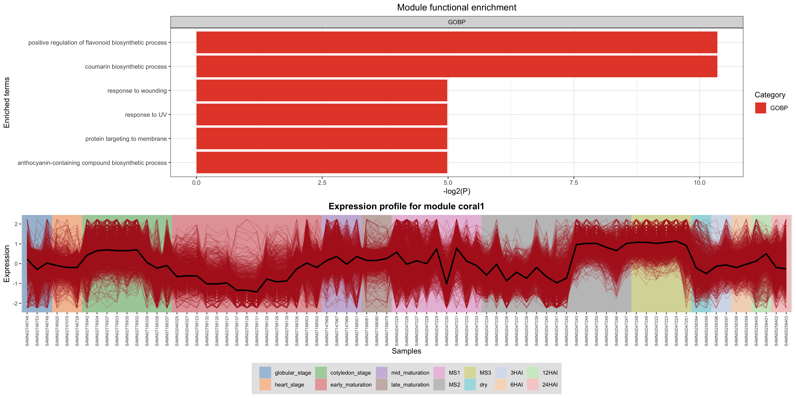
```

.green[==================].red[=======================].blue[================================].orange[===========]
&emsp;&emsp;&emsp;&emsp;Emb
&emsp;&emsp;&emsp;&emsp;&emsp;&emsp;&emsp;&emsp;&emsp;Mat
&emsp;&emsp;&emsp;&emsp;&emsp;&emsp;&emsp;&emsp;&nbsp;&emsp;&emsp;&emsp;&emsp;&emsp;Mat
&emsp;&emsp;&emsp;&emsp;&emsp;&emsp;&emsp;&emsp;&emsp;&nbsp;Germ

---

```{r}
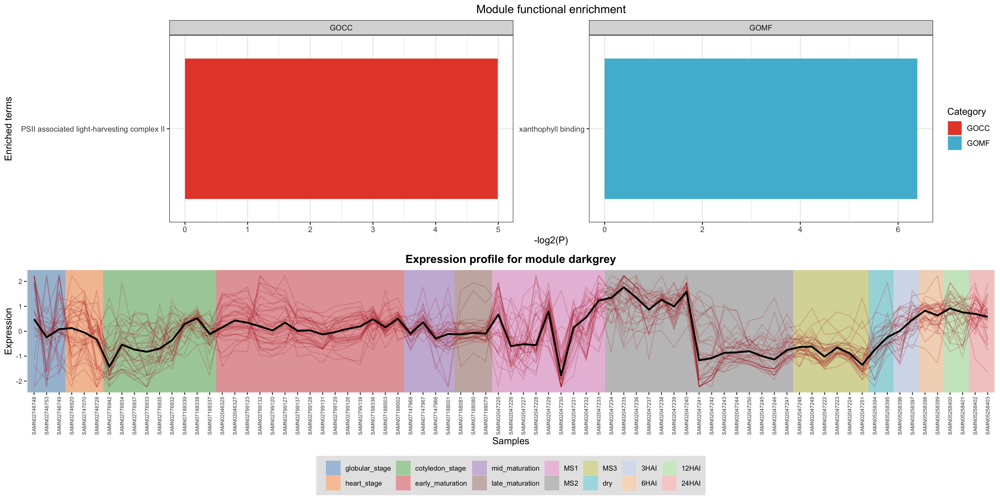
```

.green[==================].red[=======================].blue[================================].orange[===========]
&emsp;&emsp;&emsp;&emsp;Emb
&emsp;&emsp;&emsp;&emsp;&emsp;&emsp;&emsp;&emsp;&emsp;Mat
&emsp;&emsp;&emsp;&emsp;&emsp;&emsp;&emsp;&emsp;&nbsp;&emsp;&emsp;&emsp;&emsp;&emsp;Mat
&emsp;&emsp;&emsp;&emsp;&emsp;&emsp;&emsp;&emsp;&emsp;&nbsp;Germ

---

```{r}
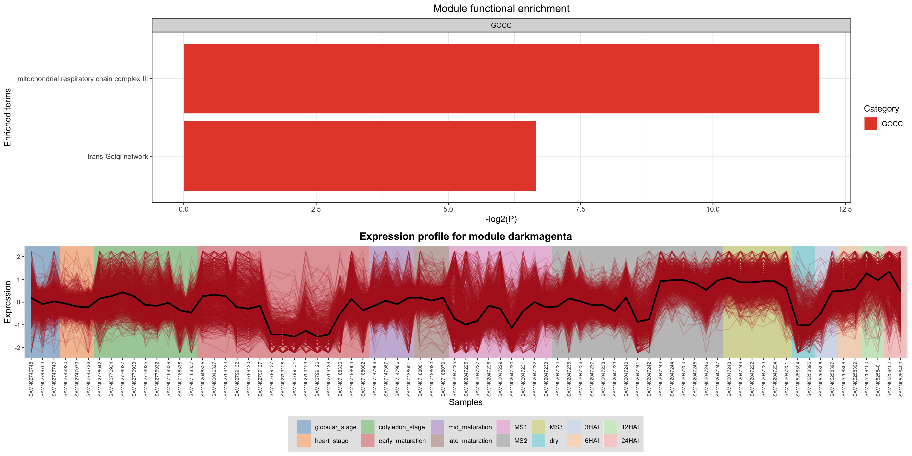
```

.green[==================].red[=======================].blue[================================].orange[===========]
&emsp;&emsp;&emsp;&emsp;Emb
&emsp;&emsp;&emsp;&emsp;&emsp;&emsp;&emsp;&emsp;&emsp;Mat
&emsp;&emsp;&emsp;&emsp;&emsp;&emsp;&emsp;&emsp;&nbsp;&emsp;&emsp;&emsp;&emsp;&emsp;Mat
&emsp;&emsp;&emsp;&emsp;&emsp;&emsp;&emsp;&emsp;&emsp;&nbsp;Germ

---

```{r}
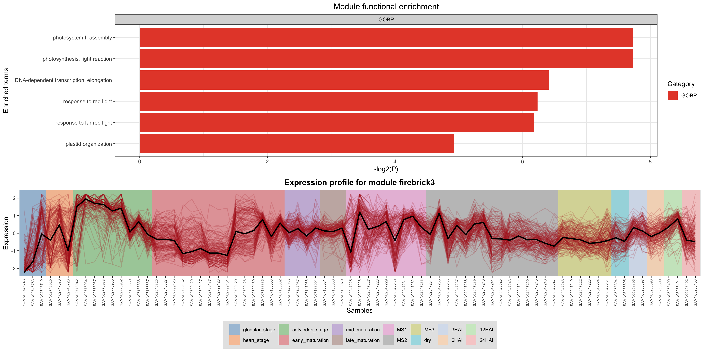
```

.green[==================].red[=======================].blue[================================].orange[===========]
&emsp;&emsp;&emsp;&emsp;Emb
&emsp;&emsp;&emsp;&emsp;&emsp;&emsp;&emsp;&emsp;&emsp;Mat
&emsp;&emsp;&emsp;&emsp;&emsp;&emsp;&emsp;&emsp;&nbsp;&emsp;&emsp;&emsp;&emsp;&emsp;Mat
&emsp;&emsp;&emsp;&emsp;&emsp;&emsp;&emsp;&emsp;&emsp;&nbsp;Germ

---

```{r}
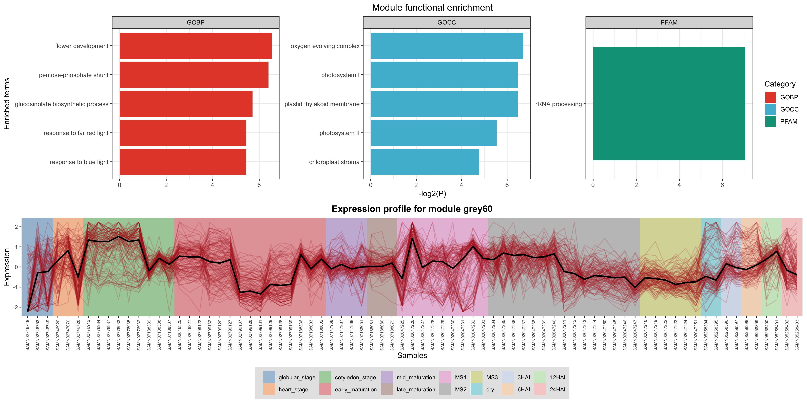
```

.green[==================].red[=======================].blue[================================].orange[===========]
&emsp;&emsp;&emsp;&emsp;Emb
&emsp;&emsp;&emsp;&emsp;&emsp;&emsp;&emsp;&emsp;&emsp;Mat
&emsp;&emsp;&emsp;&emsp;&emsp;&emsp;&emsp;&emsp;&nbsp;&emsp;&emsp;&emsp;&emsp;&emsp;Mat
&emsp;&emsp;&emsp;&emsp;&emsp;&emsp;&emsp;&emsp;&emsp;&nbsp;Germ

---

```{r}
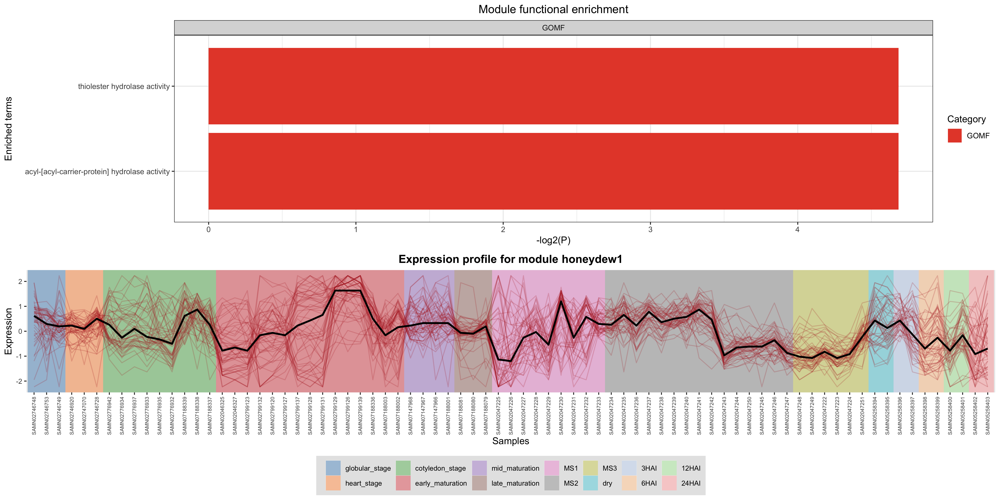
```

.green[==================].red[=======================].blue[================================].orange[===========]
&emsp;&emsp;&emsp;&emsp;Emb
&emsp;&emsp;&emsp;&emsp;&emsp;&emsp;&emsp;&emsp;&emsp;Mat
&emsp;&emsp;&emsp;&emsp;&emsp;&emsp;&emsp;&emsp;&nbsp;&emsp;&emsp;&emsp;&emsp;&emsp;Mat
&emsp;&emsp;&emsp;&emsp;&emsp;&emsp;&emsp;&emsp;&emsp;&nbsp;Germ

---

```{r}
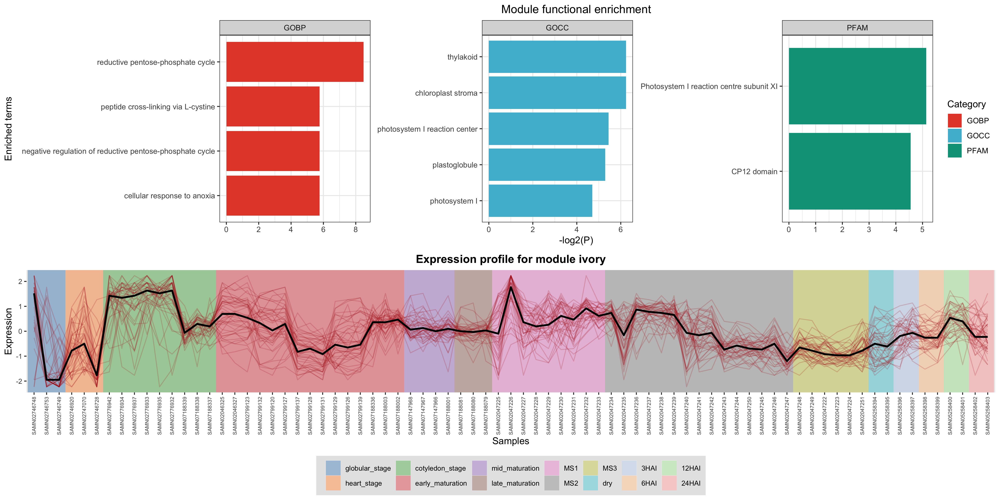
```

.green[==================].red[=======================].blue[================================].orange[===========]
&emsp;&emsp;&emsp;&emsp;Emb
&emsp;&emsp;&emsp;&emsp;&emsp;&emsp;&emsp;&emsp;&emsp;Mat
&emsp;&emsp;&emsp;&emsp;&emsp;&emsp;&emsp;&emsp;&nbsp;&emsp;&emsp;&emsp;&emsp;&emsp;Mat
&emsp;&emsp;&emsp;&emsp;&emsp;&emsp;&emsp;&emsp;&emsp;&nbsp;Germ

---

```{r}
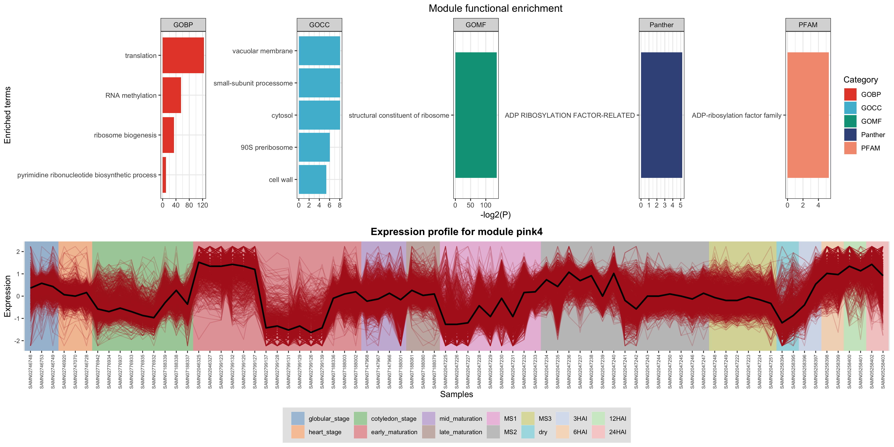
```

.green[==================].red[=======================].blue[================================].orange[===========]
&emsp;&emsp;&emsp;&emsp;Emb
&emsp;&emsp;&emsp;&emsp;&emsp;&emsp;&emsp;&emsp;&emsp;Mat
&emsp;&emsp;&emsp;&emsp;&emsp;&emsp;&emsp;&emsp;&nbsp;&emsp;&emsp;&emsp;&emsp;&emsp;Mat
&emsp;&emsp;&emsp;&emsp;&emsp;&emsp;&emsp;&emsp;&emsp;&nbsp;Germ

---

```{r}
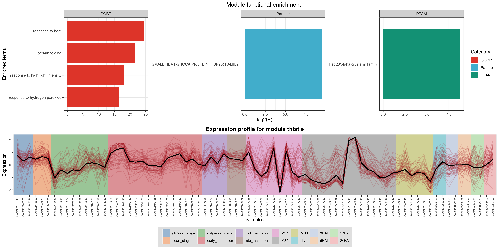
```

.green[==================].red[=======================].blue[================================].orange[===========]
&emsp;&emsp;&emsp;&emsp;Emb
&emsp;&emsp;&emsp;&emsp;&emsp;&emsp;&emsp;&emsp;&emsp;Mat
&emsp;&emsp;&emsp;&emsp;&emsp;&emsp;&emsp;&emsp;&nbsp;&emsp;&emsp;&emsp;&emsp;&emsp;Mat
&emsp;&emsp;&emsp;&emsp;&emsp;&emsp;&emsp;&emsp;&emsp;&nbsp;Germ


---

class: sydney-yellow, middle, center

## Contato

`r icons::fontawesome("envelope")`  [fabricio_almeidasilva@hotmail.com](mailto:fabricio_almeidasilva@hotmail.com)

